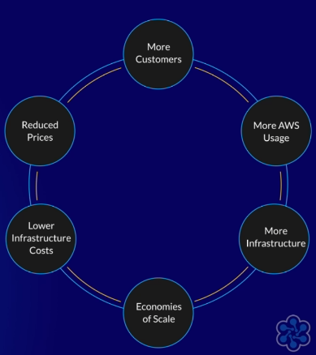

# Billing and Pricing

- AWS Cost Explorer
- AWS Cost and Usage Reports
- The purpose of **tags in cost allocation**
- AWS customer support resources and support plans
- Budgets

TODO
USAGE TYPE GROUPS

## Intro

**Without and With Cloud Computing**
- Without: Fixed costs or **capital expenses**
- With: Variable costs or **operational expenses**

**Cost management is the biggest problem** with cloud computing

**Cost Optimization** helps you meet financial and business objectives, while only paying for what you need/use

**Savings with the Cloud**
- Staff productivity
	- Staff spend less time on developing since a lot of services are already provided
	- Products develop and launch quicker
	- **Lower Total Cost of Ownership** (less hardware --> less maintenance of hardware --> IT employees can spend time doing other tasks)
- Business agility
- Operational resilience
	- Reduced cost of planned and unplanned outages
	- Reduced risk
	- Improved **Service Level Agreement (SLA)**

**Economies of Scale**
- AWS has had 69 **price reductions** in the past
- AWS benefits significantly from economies of scale
- As more and more customers use AWS, more infrastructure is needed
- Since customer base is growing, costs can be spread out across more customers, **effectively lowering prices for all customeres**
- In turn, the lowered prices can attract more customers, and the cycle repeats

## Five Pillars of Cost Optimization

1. Right-Sizing your Instances
	- Ensure what you provision is what you need (don't use larger instance sizes if it's not needed)
2. Increase Elasticity
	- Resources can shutdown when not used, and can spin up when needed during higher traffic demands
3. Pick correct Pricing Model
	- Instances: On-demand vs Spot vs Reserved
	- Throughput: On-demand vs Provisioned
4. Optimize Storage
	- Use correct storage tiers (like S3 vs S3 Glaicer, or Throughput Optimized HDD vs General Purpose SSD)
5. Measuring and Monitoring
	- Monitor via CloudTrail and CloudWatch to see how resources are scaling
	- Enforce **cost allocation tagging**
	- Review usage regularly
	- Assign cost optimization to a specialized team

## Cost Allocation Tagging

Can analyze costs by adding tags to your resources. **It is up to you and your team** to use meaningful, and well categorized key-values for your tags.

**Must enable Cost Allocation Tags** in the Billing and Cost Management page

Can use **AWS Tag Editor** to more easily manage your tags

Recommended Tags
- AWS has pre-generated tags that you can start with
- **Note:**  For _pre-generated_ tags, these can _only_ be seen in the **Billing and Cost Management Console**
- Cost center, business unit, service, workload
- Resource owner, simple resource name, environment

## The AWS Well-Architected Framework

1. Operational excellence
- Constant improvement and efficient managing of workloads
- **Operations-as-Code** - entire workload should be written
	- Reduces operational errors
	- Updates and changes can be automated (which saves time and errors)
- Frequent, but small and reversible changes
- Evolve procedures as your technology evolves
- Failure prevention
- Learn from operational failures

2. Security
- How to protect data, systems, and components using cloud technologies
- How user rights and privileges are correctly managed
- How integrity and conformity of information is maintained
- Traceability
- Applying security at all levels
- Security by automation
- Data protection with encryption and tokenization
- Denying access by default, and granting only when needed
- Have a disaster plan ready!

3. Reliability
- Focuses on the ability of a workload to perform correctly at the expected time.
- Automatic recovery and prevention from failures
- Elasticity and Scalability
- Use monitoring tools to determine appropriate resource capacities

4. Performances and Efficiency
- Efficient allocation and right-sizing of computing resources
- Take advantage of advanced and bleeding edge technologies
- Global within minutes (workload can be deployed globally at scale)
- Serverless architectures

5. Cost optimization
- Understanding and controlling expenses
- Avoiding unnecessary costs
- Analyzing spend in detail
- Adopt a consumption model
- Implement **Cloud Financial Management**
- Downsize eon-premise data centers (when possible)

## Terminology

### Technology Terms

Reserved Instances (RIs)

Savings Plans
- Similar to RIs, except more flexible and can only be applied to compute usage

Convertible/Standard (for Reserved Instances)
- Ability to convert _reserved instances_ to different tiers
- Standard RIs cannot be changed for their entire term

DevOps
- Building and automating consistent and secure pipelines and systems for developers

Enterprise Architecture (EA)
- Groups tasked with outlining the structure of an enterprise system

Lift & Shift
- Migrating an application that's already built
- Usually migrating from one environment to another (like private to public cloud)

### Finance Terms

Amortization
- Retiring a payment of capital gradually overtime (on a schedule) that shows the benefits that said capital provides

Operating Expenditure (Opex)
- Business expense made in a specific accounting period, which provide benefits for only this same accounting period
- Example: paying for cloud services

Capital Expenditure (Capex)
- Purchase of capitalizable asset (like equipment) that provides value over a long term
- Example: buying a data center and using it over 30 years

Return on Investment (ROI)
- Amount of profit made from an investment

Income Statement (or P&L)
- Company's net profit or less over a period of time

Net Present Value (NPV)
- Long term profitability of a project

Depreciation
- Retiring the cost of an asset gradually overtime, on a schedule

EBITDA
- Earnings Before Interest, Taxes, Depreciation, and Amortization
- Subtracts only cost of goods from the revenue gained

Capitalization
- Treating an investment or outlay as a capital item which can be depreciated or amortized in future periods

Cost Allocation
- Allocating costs to appropriate cost categories

Unit Economics
- Comparing overall cost to the overall business benefit on a per unit basis
- Example: how much does a web page visit make?

Balance Sheet
- Statement of a business's financial position on a specific date
- Indicates value of all assets and liabilities
- Includes value of undepreciated and unamortized capitalizable items

## Credits

Credits are a **reward system**
- Can earn credits by publishing an Alexa skill, or attending webinars and events
- Applied to bills to help cover costs
- Applied until they are exhausted or _expire_

## Cost Explorer

Usage Types
- Every service uses this to measure the usage of a specific type of resource
- Example: how long were my `t2.micro` instances running in the last month

Usage Type Groups
- Collects a specific category of usage type filters and puts it into one group
- Example: how long were ALL my EC2 instances running last month

Unblended Costs
- Represents usage costs on the day they are charged to you

Amortized Costs
- Useful for when you purchase reservations (like reserved instances or savings plans)
- Recurring fees and upfront costs are evenly distributed across the month
	- Recurring fees for reservations are charged on the first day of the month, which can lead to a cost spike on that day.

Net Unblended Costs
- Includes discounts

Net Amortized Costs
- Includes discounts

## Cost and Usage Explorer (CUR)

CURs are the **most granular and detailed way to collect data for costs and usage**
- CUR data is not tracked until it is enabled
- Can be stored in an S3 bucket
- Can export data to following services
	- Amazon Athena (Parquet file) - analyze data with SQL
	- Amazon Redshift (CSV file) - data warehouse for very large data sets
	- Amazon QuickSight (CSV file) - business intelligence service that can aggregate data into a dashboard for better and easier visualization

## Budgets

Budgets allow users to get notified when costs or usages exceed a certain amount

**Budget Types**
1. Cost budget - based on actual costs
2. Usage budget - based on usage
3. Reservation budget - for reserved instances
4. Savings Plans budget

Can set expiring or recurring budget

Specifying budget amount
- Can specify a total fixed amount
- Can specify budget for each month (individually)

Setting up notifications
- Emails
- via SNS

Triggers for Budget Actions
- Execute actions when a budget reaches a threshold
- Must configure an IAM role, so the budget actions have permission to do things
- One action is stop all EC2 and RDS instances
	- Can specify which region to affect
