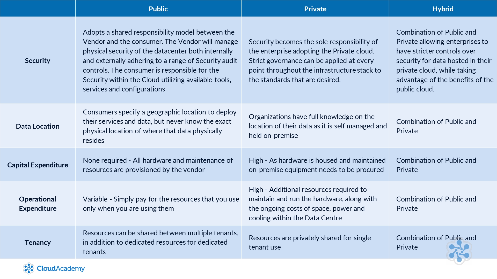

# Cloud Computing

## What is Cloud Computing and Virtualization?

**Cloud Computing** is a remote virtual pool of on-demand shared resources that can be rapidly deployed at scale. Offers common services such as Compute, Storage, Database, and Network
- Compute: does computational workload (in non-cloud, this would be CPUs and RAM)
- Storage: storing data (in non-cloud, this would be storage devices connected to your device, or a NAS or SAN)
- Database: storing structured/unstructured data
- Network: provides connectivity between these other services mentioned so that they can communicate with each other (in non-cloud, this would be routers and firewalls)

Cloud computing is possible with the use of **virtual machines**, which are operating systems simulated on a single physical machine (known as the host).
- VMs share resources available to the host, but a VM does not know that it is sharing these resources
- VMs are sometimes known as **"instances"**

The **hypervisor** is a key component of virtualization.
- Used to create the virtualized environment
- Sits between the VMs and the host
- Creates a shared pool of hardware resources for each VM to access
- When a VM requests to use hardware, it goes through the hypervisor.

**Benefits of Virtualization**
- Reduced capital expenditure - less hardware needed since you can run multiple VMs on a single machine
- Reduce operating costs - less hardware, maintenance, space and cooling required, etc
- Smaller footprint - less space required since machines are being virtualized
- Optimization of resources - in a cloud environment, everyone benefits from the virtualization

## Deployment Models

Public
- Available for public use (duh...)
- Consumers can specify which region they want their cloud computing services to reside in (useful for reducing latency based on where end-users are located)
- Cloud Vendor provides ALL hardware and operates/maintains it

Private
- Restricted to certain groups/people (i.e. a company)
- Hardware is _usually_ on-premise
- Gives companies more control over their cloud services and security of their data
- Virtualization is still used, however the **resources are privately shared** for single tenant use (the company)
- More capital expenditure and costs required to own and maintain the hardware

Hybrid
- Makes use of both Public and Private clouds
- Established when a network link is configured between the private cloud to services within the public cloud
- Contains the pros/cons of BOTH public and private clouds
- Uses cases
	- For seasonal burst traffic, or for **disaster recovery**
	- When transitioning from private to public cloud or vice-versa
	- Short-term configurations (test/dev purposes)

## Cloud Concepts

On-Demand Resourcing
- When you want to provision a resource within the cloud, it's almost immediately available to you
- Don't have to wait for the hardware to be delivered, installed, etc.

Scalability
- Cloud makes it easier to scale resources "up and down" AND "in and out"
	- UP/DOWN scaling: altering power or performance of an instance (i.e. better hardware)
	- IN/OUT scaling: adding/removing more instances

Economy of Scale
- Because public cloud computing needs a huge scale of resources, virtualization makes it easier and cheaper for both the vendor and customer

Flexibility and Elasticity
- Can pick amount of resources you need
- Can pick how long you need those resources
- Can pick the scale of those resources

Growth
- Your team can grow much faster since you don't need to worry about the maintenance of the resources (so you can spend more time developing and less time maintaning)
	- Combined with on-demand resourcing, companies can grow much faster
- Can reach global customers more easily by utilizing global resources provided by your cloud vendor

Utility Based Metering
- Only pay for what resources you use, and for how long you use them for

Shared Infrastructure
- Because hosts in the cloud are virtualized, multiple customers will be using VMs on the same hardware
- Some vendors offer dedicated tenancy, where a host is reserved for 1 customer (so no other customer can have VM resources on that same host)

Highly Available
- Many core services in the cloud are replicated across different geographic zones and regions

Security
- Companies have concerns that public cloud vendors (i.e. AWS, GC, Azure) may not be secure. However, these vendors are most likely **more secure** than your own
- Because public vendors serve customers globally, they have to be compliant with many third-party, governmental, and international regulations

## Cloud Service Models

SaaS
- A piece of software is offered to you as a product (i.e. GMail)
- You don't maintain the software, underlying hardware, or OS

PaaS
- Gives more management and control than SaaS
- Access to a framework given by the OS
- You maintain the software
- You do not maintain underlying hardware or OS
- Makes for a great deployment service for developers

IaaS
- Highest level of management
- Can architect your own portion of the cloud, by configuring a virtual network
- Can configure instances given by the OS, which means you can configure the OS of your VMs
- You maintain software and how your portion of the cloud is configured
- You still don't maintain the hardware

## Common Use Cases

- Traffic Bursting
	- You might use your own hardware and computing resources, but occasionally require additional resources (say holiday seasonal demand)
	- You can use cloud computing to help with the additional traffic/demand, and you only pay for what you used
- Backup and Disaster Recovery
	- Public cloud's have lots of resiliency, durability, and availability
	- Access to nearly unlimited storage space
- Web Hosting
	- Because cloud computing have high scalibility, you can take advantage of "on-demand resourcing" to scale your servers up/down based on traffic
	- Can also take advantage of CDNs and Load balancers
- Test/Dev Environments
	- Can be a little playground for testing/experimenting since you don't have to buy extra hardware
- Proof of Concept
	- Can help bring ideas to life at a fraction of the cost
- Big Data
	- Vendors can take care of the expensive compute resources needed to work with big data
	- You only need to worry about analyzing your data with the vendor's services

## Architecture of a Datacenter

Although you may not need to run your own datacenter (since a vendor will do that for you), it's still important to know the components of a datacenter

Location
- Where the datacenter is and how many datacenters you have
- Public vendors have datacenters worldwide

Physical Security
- End user has no access to the physical datacenter
- Vendor is responsible to be compliant with government and 3rd party regulations

Mechanical and Electrical Infrastructure
- Includes managing generators, UPS (uninterruptible power supply), AC units for cooling, fire suppression
- Vendor is responsible to make sure they have enough capacity, resiliency, and overall safety of their datacenter

Netowrk Infrastructure
- Networking operates at a software level, so there are no options to install a switch or router. But you can still configure the network to simulate the same effects that these physical devices would provide. In fact, these physical components are replaced by virtual networks
- Can create virtual network, which allows you to separate your resources onto their own network, isolated from other networks.
- Routing and Access Control Lists can be configured _dynamically_ for even more control
- Although the hardware is managed by vendor, **you are responsible for designing and securing your virtual network**

Servers
- Referred to as "instances" or "virtual machines"
- Different types of servers within a datacenter (some are focused with hosting databases, some are focused with heavy computing power)

Storage
- In public cloud, often regarded as unlimited, durable, and scalable

# Is Cloud For You?
