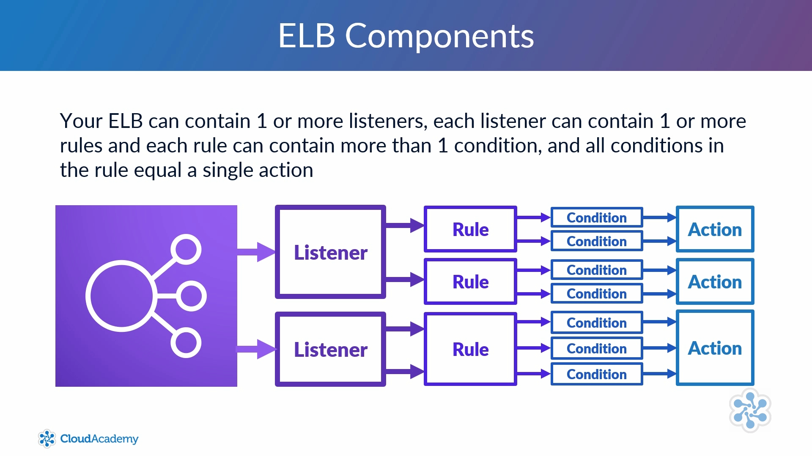

# Compute Fundamentals

## EC2

### Components

#### Amazon Machine Images (AMIs)
- Pre-configured templates of EC2 instances (for quick launches)
- A baseline with an operating system and some applications pre-installed
- Can create your own AMIs to speed up iterative deployments

#### Instance types
- Instances can be configured with different performance capabilities (vCPUs, type of processor, clock speed, RAM, network performance, storage)

#### Instance Families
- Micro: low-cost, low network bandwidth, low performance
- General Purpose: balanced mix of cpu, memory, and storage
- Compute Optimized: Higher ratio of cpus to memory, lowest cost per cpu
- GPU: for graphics-intensive workloads
- FPGA: provides field programmable gate arrays for specific hardware accelerations (high cpu, large memory, high network bandwidth)
- Memory Optimized: higher ratio of memory to cpus, lowest cost per GB of RAM
- Storage Optimized: ssd-backed, high I/O, low latency

#### Instance Purchasing Options
On Demand
- Launched at any time
- Can use as long as needed
- Flat rate based on instance type
- Typically for short-term use
- Best for test and dev envs

Reserved
- Purchase for a set period of time at reduced cost
- Can pay all upfront (for 1 or 3 years at a time), partial upfront, or no upfront
	- Paying more upfront gives bigger discounts
- Best for long-term, predictable workloads

Scheduled
- Reserve on a recurring schedule (i.e. daily, weekly, monthly)
- Even if you don't use the resource, you are still charged

Spot
- Bid for unused EC2 compute resources
- No guarantee for fixed period of time
- Prices fluctuate based on supply/demand
- Can purchase very large instances at low prices
- Best for processing data that can be suddenly interrupted

On-Demand Capacity Reservation
- Reserve capacity based on some attributes (i.e. instance type, platform, tenancy) within a particular AZ for any period of time
- Can be used in conjuction with the discount from reserved instances

#### Tenancy
Relates to the underlying host that your EC2 instance resides on

Shared Tenancy
- Resource launched on any available host with the required resources
- Same host can be used by multiple customers
- AWS prevents one instance from accessing another in the same host

Dedicated Instances
- Hosted on hardware that no other customer can access
- Usually needed to meet compliance
- Incurs additional charges

Dedicated Hosts
- Additional visibility and control on the physical host
- Allows to use the same host for a number of instances
- May be needed to meet compliance

#### User Data
Allows you to enter commands that wil run during the first boot cycle of that instance

#### Storage Options
Two types: persistent and ephemeral

Persistent Storage
- Provided by attaching EBS volumes
- EBS volumes are separated from EC2 instances (so you can detach a volume from one instance and attach it to another)
- Volumes are **logically** attached via AWS network
- Volumes support encryption and can take backup snapshots

Ephemeral Storage
- Created by EC2 instances using local storage
- **Physically** attached to the underlying host
- When instance is stopped or terminated, all data is lost.
	- However, if you reboot, data remains intact
- Cannot detach ephemeral storage

#### Security
- Configure a **security group** for the instance, which is basically an "instance-level" firewall that allows inbound and outbound traffic
- Create/use a cryptographic key-pair in order to encrypt login information, as well as for ssh connection
	- The public key is held by AWS. you hold the private key, and **it is your responsibilty to keep it safe**
- Customer is responsible for maintaining and installing latest OS and security patches on their instance

## Elastic Container Service (ECS)

Allows you to run Docker containers across a cluster of EC2 instances
- Managing the cluster is handled by **AWS Fargate**

**AWS Fargate** is an engine that enables EC2 to run containers, without having to manage and provision instances and clusters for the containers

A **container** holds everything an application needs to run from within with container package

Can launch an **ECS cluster** in two ways
1. Fargate Launch - you must specify the CPU and RAM required, networking and IAM policies, and packaging your app into containers
2. EC2 Launch - responsible for patching and scaling instances, specifying instance type, and how many containers are in a cluster

An **ECS cluster** is a collection of EC2 instances
- These instances function in the same way as a typical instance
	- Features such as security groups, elastic load balancing, and auto scaling can be used with these instances
- Clusters act as a resource pool, aggregating hardware resources
- Dynamically scalable and multiple instances can be used
- Can only scale in a single reigon
- Containers can be scheduled to be deployed across your cluster
- Instances within a cluster also have a Docker daemon and an ECS agent, which together allow ECS commands to be translated into Docker commands

## Elastic Container Registry (ECR)

A secure location to store and manage your own docker images
- Primarily used by developers to push, pull, and manage their library of images

### Components of ECR

#### Registry
- Hosts and stores docker images
- Can create **image repositories**
- For any image you create, your account will have read and write access by default to those images
- Access to registry and images can be controlled via IAM and **repository policies**
- In order for your docker client to access ECR, you need to have an AWS Authorization Token

#### Authorization Token
- Can fetch token via AWS CLI using `aws ecr get-login-password`
- **NOTE:** The user must have permission to the `ecr:GetAuthorizationToken` action
- The token expires after 12 hours

#### Repository (or Image Repository)
- Groups multiple docker images together
- Can create multiple repos
- Can use IAM and repository policies

#### Repository Policy
- Resource based policies
- Determines who has access to which repositories/images, and what they can do with those objects

#### Image
- These are the docker images that you want to store

## Elastic Container Service for Kubernetes (EKS)

See [EKS](/compute/ec2/eks.md)

## Elastic Beanstalk

See [Elastic Beanstalk](/compute/ec2/elastic-beanstalk.md)

## Lambda

See [Lambda](/compute/ec2/lambda.md)

## Batch

See [Batch](/compute/ec2/batch.md)

## Lightsail

See [Lightsail](/compute/ec2/lightsail.md)

# Elastic Load Balancing

## Elastic Load Balancer (ELB)

To manage and control the flow of inbound requests destined to a group of targets
- Targets could be EC2 instances, Lambdas, IP addresses, containers
- Targets can reside in different AZs, or all placed in a single AZ

ELBs can detect when an instance goes down, and re-route traffic to healthy instances accordingly

### Components of ELB

- **Listeners** - defines how inbound connections are routed to your **target groups** based on ports and protocols set as **conditions**
- **Target groups** - a group of resources that you want the ELB to route requests to based on **rules**
- **Targets** - the resources in a target group
- **Rules** - define how an incoming requests gets routed to which target group
- **Health checks** - a health check is performed against all resources within a target group
- **Internet-facing ELB**
	- The **nodes** of an ELB are accessible via internet and thus have a public DNS name, public IP, and an internal IP
	- This allows the ELB to serve incoming requests from the internet
- **Internal ELB** - an internal ELB that has **only** an internal IP, so it can only serve requests that originate from within the ELB's VPC
- **ELB Nodes** - used by ELB to distribute traffic to your target groups
	- An ELB node is created within every AZ that your ELB is deployed to
- **Cross-Zone Load Balancing** - distributes traffic evenly between all resources in all AZs that the ELB is deployed to
	- Suppose you have 4 instances in Zone1 and 10 instances in Zone2
	- Without cross zone balancing, traffic is split equally **amongst the AZs**:
		- 50% of traffic is routed to each zone
		- In Zone1, each of the 4 instances will handle 12.5% of all requests
		- In Zone2, each instance will handle 5% of all requests
	- With cross zone balancing, traffic is split equally **amongst the resources**:
		- Since there are 14 total resources, each resource will end up handling ~7% of all requests.

[**AWS Official Comparison of Elastic Load Balancing**](https://aws.amazon.com/elasticloadbalancing/features/#compare)
- ALB has the most features
- NLB is most performant
- Classic balancer is more of a legacy option, and instead AWS recommends to use ALB or NLB over the classic balancer. _Note: There is an exception, see the Classic Load Balancer section_

[**Differences between ALB and NLB**](https://blog.cloudcraft.co/alb-vs-nlb-which-aws-load-balancer-fits-your-needs/)

## Using HTTPS as an ALB Listener

- You need an X509 server certificate and an associated security policy
	- This is needed to allow the ALB to decrypt the HTTPS requests in order to figure out which target group to forward the request to
- Selecting a certificate:
	- Can select from/upload to ACM (recommended)
	- Can select from/upload to IAM (only recommended when deploying ELBs in regions that are not supported by ACM)

## Application Load Balancer (ALB)

**Operates at Layer 7 of the OSI Model: "Application"**
- Only handles HTTP or HTTPS traffic
- Because it operates at Layer 7, an ALB can route traffic based on any detail in the HTTP request received (i.e. headers, payload, query parameters)
- Provides advanced routing and visibility features
- Example: your ALB may route HTTP traffic to Target Group 1, and HTTPS to Target Group 2

## Network Load Balancer (NLB)

**Operates at Layer 4 of the OSI Model: "Transport"**
- Allows you to balancer requests purely based on the TCP, TLS, or UDP protocol
- Because it operates at Layer 4, an NLB can only route traffic based on the connection
	- Because NLBs do not inspect every aspect of a request, they need significantly less time to forward requests compared to ALBs
- Able to process millions of requests per second while maintaining low latency
- If your application's logic requires a static IP address, then an NLB is a good choice

Supports cross-zone load balancing
- NLB nodes use an algorithm to select a target in a zone
	- Algorithm is based on the TCP sequence, protocol, source port, source IP, destination port, destionation IP
- When a TCP connection is established with a target host, then the connections remains open with that target for the duration of the request

## Classic Load Balancer

- Supports HTTP, HTTPS, and TCP
- **Best practice to use ALB over the classic load balancer**, unless you have an application already running in the EC2-classic network
	- EC2-classic is no longer supported for newer AWS accounts
	- EC2-classic allowed you to deploy instances in a single, flat network shared with other customers, instead of inside a VPC like it's done now

Does not have provide as many features as ALB, HOWEVER has the following features that ALB does not have:
- Support for EC2 classic
- Support for TCP and SSL listeners
- Support for sticky sessions using application-generated cookies
- DOES NOT support target groups, can only route traffic to individual targets

# EC2 Auto Scaling

**EC2 Auto Scaling** will automatically increase/decrease your EC2 resources to meet demand based off of custom defined metrics and thresholds (i.e. CPU, RAM, response times)
- AWS also has a more generalized version called **AWS Auto Scaling**
- This approach of scaling is considered **scaling in/out or scaling horizontally**
- Examples:
	- When CPU usage is above 75%, add more instances
	- When CPU usage is below 25%, terminate some instances

Benefits
- Cost Saving - auto scaling can scale back when metrics/thresholds drop below a certain value, helping you save money on resources used (because you didn't need those extra resources)
- Customer Satisfaction - if you properly set auto scaling thresholds, then it's unlikely that customers will experience performance issues

**Integrating auto scaling with ELBs** can significantly improve how scalable and flexible your architecture is (more on this later...)

## Components of EC2 Auto Scaling

Two main components
1. Creating a **launch config** or **launch template** (_note:_ these are not the same)
2. Creating an **auto scaling group**
	- Without a launch config/template, your auto scaling group cannot know what instance it is launching, nor does it know how to configure the instance (i.e. security groups, IAM roles, storage volumes)

**Launch configs/templates** answer the following questions:
- What AMI to use
- What instance type
- Whether to use spot instances
- Whether and when public IPs should be used
- Whether user data is on first boot
- How to configure storage volume
- Security groups

**Auto Scaling Group** defines:
- Desired capacity, and other limitation of the group using scaling policies
- Where the group should scale resources, such as which AZ

### Launch Template vs Launch Configuration

Launch templates are the newer and more advanced version of the launch configuration
- Preferred over launch configuration
- Templates allow you to simplify how you launch instances for your auto scaling groups
- Can extend templates from existing ones

Launch templates allow you to select an IAM instance profile to associate with your instances
- Launch configurations, you select an IAM role instead

## Integrating ELBs and EC2 Auto Scaling

On their own, ELBs and auto scaling overcome really big hurdles. However, they also have their drawbacks
- Suppose an ELB gets hit with a sudden increase in traffic. Although the ELB can evenly distribute traffic across the resources, all of the resources might be under heavy load, which can lead to slower response times.
- Suppose an auto scaling group also gets hit with a burst of traffic. Here, more resources will be spun up in order to compensate for the increased demand. However, there is no guarantee that the traffic is distributed fairly across all of these new resources. As a result, you may have a 1 or 2 resources taking all of the burden.

When attaching an ELB to an auto scaling group, the ELB automatically detects the instances in the group, and will distribute all traffic to those instances.
- To associate an ELB, you must associate the auto scaling group with the ELB target group
- For a classic load balancer, the EC2 fleet is registered directly with the load balancer
