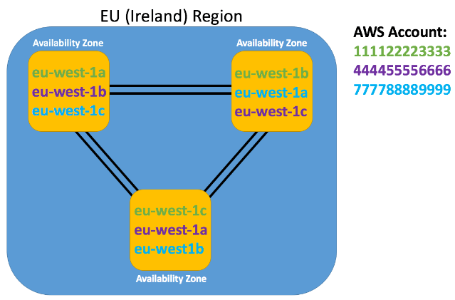

# Global Infrastructure

- Availability Zones
- Regions
- Edge Locations
- Regional Edge Caches

## Availability Zones

- AZs are essentially the physical data centers, where the actual compute, storage, network, and database resources are hosted
	- **Note:** A single AZ IS NOT a single data center. Rather, an AZ is comprised of multiple data centers located close to each other
- Every AZ has at least 1 other AZ within the same **region** (i.e. city).
	- AZs within same region are linked together with highly resilient and low latency private fiber optic connections
	- These links are responsible for replicating data for high availability and resiliency purposes.
- Every AZ has isolated power and network connectivity. This minimizes impact to other AZs should one fail/go down
- **Best Practice:** use at least two AZs in a given region to help maintain high availability

## Regions

A **region** is a collection of AZs that are geographically close to each other (generally within same city)

- Every region act independently of other regions
- Every region contains at least 3 AZs
- AWS has regions deployed around the world for
	1. High availability/resiliency (i.e. a natural disaster takes out an entire region)
	2. Reducing latency for end-users (i.e. it's closer for users in London to interact with AWS regions located in Europe, as opposed to regions located in Australia or US)
	3. Compliance with regulations and laws (i.e. may be required to keep certain data within a certain location)
- **Note:** certain AWS services **may not be available in certain regions**
	- There are some global AWS services, such as IAM or CloudFront
- AWS also provides government-isolated regions, which are regions only available to a particular nation's government

## Naming Convention for Regions and AZs

Regions have a human-friendly name and a code-name (the code name is used in programs and CLI)
- Friendly: `US East (N. Viriginia)`
- Code name: `us-east-1`

AZs are always referenced by a code-name, which is just the region code name followed by a letter
- `us-east-1a` or `eu-west-2c`
- The letter identifies a particular AZ

If you have multiple AWS accounts, and you try to coordinate resources within the same AZ by selecting an AZ code name, then this does not guarantee that the resources are physically in the same AZ (see image below)

## Edge Locations

**Edge locations** are AWS sites deployed in major cities and highly populated areas

- Edge locations ARE NOT for deploing main infrastructure. They are primarily for caching data and reducing latency for end-users by using the edge locations as CDNs
	- Your EC2 is deployed in America and is configured with a CloudFront distrobution
	- When a user in Europe accesses your app, if the response is cached at a nearby edge location, the user will fetch data from there (thereby reducing overall latency, because they would be interacting a CDN in Europe, as opposed to one in America)
- There are significantly more edge locations than AZs

## Regional Edge Caches

A **regional edge cache** has a larger cache-width than each individual edge location

Since data caches expire at edge locations, the data is retained at regional edge caches. This is good because when data is requested at an edge location and the cached data has expired, then the data can still be fetched from the regional edge cache  (instead of hitting the origin server, which has a higher latency)
