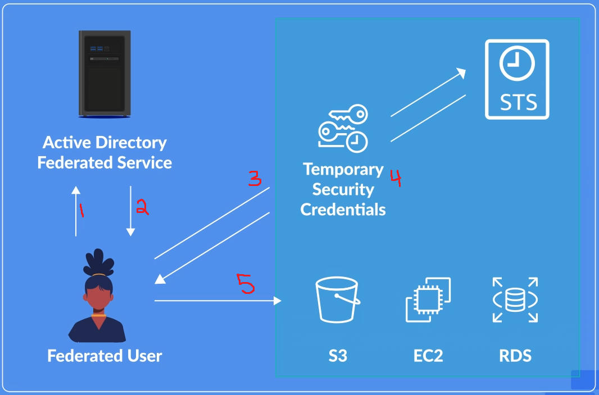

# Security and Compliance

## AWS Artifact
AWS Artifact is a dashboard that provides
- Security and compliance reports known as **audit artifacts** (useful for auditing purposes)
	- Audit artifacts can be shared with auditors and regulators by creating IAM users with an associated identity-based policy that grantes access only to the necessary reports
- View, download, accept, and terminate legal agreements between you and AWS, at both the account and organization level
- Remember that AWS guarantees security _of the cloud_, whereas you must guarantee security of your applications _in the cloud_

## Identity and Access Management (IAM)

### Core Components
**Identity Management**
- Defines who you are, such as your username
- Verifying who you are, such as with a password, 2FA, security key, etc

**Access Management**
- Determines what actions a particular identity can perform (i.e. reading a database, writing to a S3 bucket)

**Access Control**
- Mechanism of accessing a secured resource
- Secured via
	- Username and password (authenticate and verify)
	- Multi-Factor Authentication
	- Federated Access - where users external to AWS can still acess resources without having to supply AWS user credentials. Instead, credentials are fetched from **identity providers**
		- [More info on identity federation](/iam/identity-federation.md)

**Definitions** (see [IAM Definitions](/iam/index.md#definitions))
- Users
- Groups
- Roles
- Policies
- Identity Providers and [Identity Federation](/iam/identity-federation.md)
- [Security Token Service](/iam/identity-federation.md#security-token-service-(sts))

### IAM Users
If creating a user through API or CLI, you can specify a **`Path`** for the user, which is used to help structure and organize your user identities
- Can also leverage **paths** when defining policies
	```json
	// All users whose path matches the resource are allowed any action in S3
	// Ex) the path /MyCompany/US/vishal is matched
	// Ex) the path /MyCompany/UK/brian is not matched
	{
		"Version": "...",
		"Statement": [
			{
				"Effect": "Allow",
				"Action": "s3:*",
				"Resource": "/MyCompany/US/*"
			}
		]
	}
	```

**Creating a user**
- Username has max length of 64 chars
- Select access type options
	- Management console - if selected, then user is required to have a password
	- Programmatic Access
- Assign permissions through policies applied to the user or through policies inherited from a group
- Adding tags

**Managing IAM Users**
- Policies and Permissions
	- Add/remove policies
	- Set **permission boundaries** - controls max permissions a user can have (see [Types of Policies](#types-of-policies))
	- **Generate new policy based on CloudTrail events** - AWS looks at your activity from CloudTrail events and generates a policy based on the services and actions you use
- Add/remove groups
- Tags
- Security Credentials
	- Enable/disable console password
	- Change console password
	- Enable/disable MFA
	- Manage access keys
- **Access Advisor** - shows which services a user can/has accessed based on their current permissions
	- Tracks the last time a service was accessed

### IAM Roles
Whenever a trusted entity (see below) assumes a role, the permissions of the role **completely replace** the permissions of the trusted entity
- Alice has full access to S3. Role has full access to RDS.
- When Alice assumes the role, Alice no longer has any access to S3. If Alice wants access to S3 while assuming the role, then the role's policy needs to explicitly include that.

Each time a role is assumed, a new set of credentials is created
- Roles do not have _long-term_ credentials (remember, roles are for temporary access)
- Roles do not have access keys or programmatic access

Roles use **trusts**, which define who or what can assume the role
- **Trust relationships** can be formed with Users, AWS accounts, or AWS services
- A trust relationship specifies a **trusted entity**, which means that said entity is allowed to assume this role
- A user must also have **permission to assume the role** (via some policy)
	- Specifically grant the `sts:AssumeRole` action:
	```
	{
		"Effect": "Allow",
		"Action": "sts:AssumeRole",
		"Resource": "arn:aws:iam::TRUSTING_ACCOUNT_ID:role/NAME_OF_ROLE"
	}
	```
- So in order for a user to assume a role, the following must be satisfied:
	1. The user is a **trusted entity** for the role
	2. The user has **permission to assume** the role

**Service roles** are roles that allow an AWS service to assume a role to access other resources
- By using service roles, you don't need to embed credentials into your EC2 instance; instead the instance assumes the role

**Service-linked roles** are designed for 1 particular service and pre-configured with relevant managed policies, trusts, and permissions
- Cannot edit service-linked roles
- One example is `ServiceRoleForAmazonSSM`, and the trusted identity for this role is `ssm.amazonaws.com`

**Examples of using roles**
- Use a role to grant access for a user in the same account as the role
- Use a role to grant access for a user in one account, in order to access resources in another account
- An AWS service, such as EC2 instance, need to access other resources, so it uses a **service role**
- Federated users who require access to resources

### Identity Federation and Assuming Roles
**What is Identity Federation?**
- Method of authentication between two different providers
- Users from the **Identity Provider (IdP)** request to access resources on the **Service Provider (SP)**
- **IdP** authenticates the user
- **SP** controls access to their service and resources based on the IdP's authentication
- A common example of identity federation is using OAuth with social media accounts in order to create an account on other websites/services

**2 ways to gain federated access**
- WebIdentity - primarily used for large scale access from unknown users
- SAML 2.0 - primarily used for an already existing directory (such as Microsoft Active Directory)
	- Used by lots of firms and companies since users can login via the company's SSO (which would integrate with their existing user directory), and then assume roles to access resources on AWS

When creating a role for users federating via SAML, you can specify whether to provide only programmatic access or programmatic and management console access



### Access Reports
**Access Analyzer**
- Generate findings when a policy on a resource _within_ your zone of trust _allows access from outside_ your zone of trust
- Any resource that allows external access to your resources will be flagged
	- Could be an IAM role allowing cross-account access
	- Could be a bucket that allows a different account to upload objects
- Good because it helps you identify intended and unintended access

**Credential Report**
- Generate and download CSV files containing a list of all of your IAM users and their credentials
- Can check last time an account was used, when a password was last changed, if MFA is enabled

**Organizational Activity**
- Available when using AWS Organizations
- Can select an **organizational unit (OU)** or account to view its activity

**Service Control Policy (SCP)**
- Ties in with Organizational Activity
- An SCP does not grant permissions (unlike identity-based policies); instead they implement and enforces a boundary of permissions for AWS accounts
- Determines what an account **may or may not do**
- Example
	- Suppose Alice has full access to S3, RDS, and EC2 via an identity-based policy
	- Suppose there is an SCP associated with Alice's account, and the SCP denies access to S3
	- As a result, Alice only has access to RDS and EC2

### Types of Policies
[See Types of Policies](/iam/iam-policy.md#types-of-policies)

IAM policies can specify either `"Action"` or `"NotAction"`
- `NotAction` means "any action but the ones specified"

IAM policies can specify either `Resource` or `NotResource`

### Policy Evaluation Logic
[See Policy Evaluation Logic](/iam/iam-policy.md#policy-evaluation-logic)

### Trusted Advisor
[See Trusted Advisor](/iam/trusted-advisor.md)

## AWS Organizations
[See AWS Organizations](/iam/aws-organizations.md)
