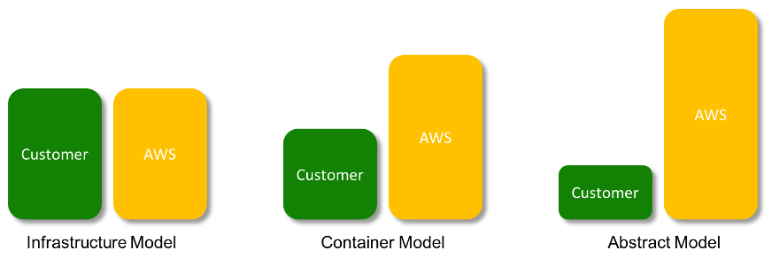
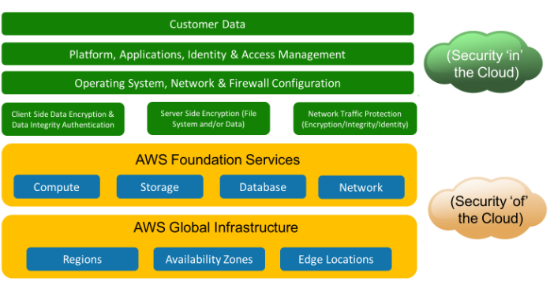
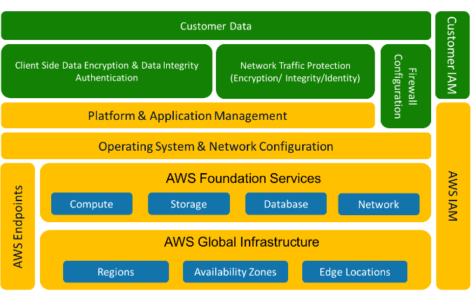
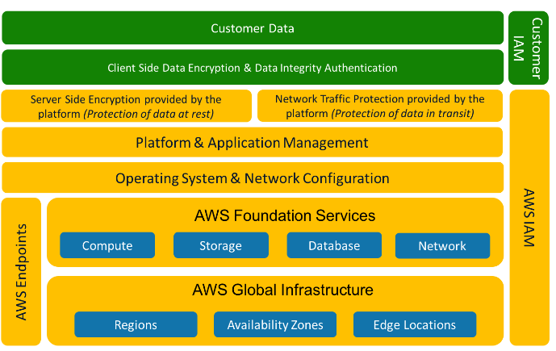

# Shared Responsibility

AWS will **always** be responsible for
- **Foundational Services:** Compute, Storage, Database, and Network services
- **Global infrastructure:**  regions, AZs, and edge locations

## For Infrastructure Services

AWS is responsible for security **of the cloud**
- Physically and digitally protecting their data centers
- Maintaining hardware and equipment

Customers are responsible for security **in the cloud**
- Restricting access to resources via IAM
- Protecting against common attacks

Customer
- Access control and IAM
- Client data encryption (data at rest)
- Enabling SSE for certain services
- Network traffic (i.e. encrypt data in transit)
- Managing platforms and applications
- Firewall configuration
- Operating systems
- Network configuration

AWS
- **Foundational Services** and **Global Infra**

## For Container Services

Some examples of AWS container services
- RDS
- Elastic Map Reduce (EMR)
- Elastic Beanstalk

Customer
- Access control and IAM
- Client data encryption (data at rest)
- Enabling SSE for certain services
- Network traffic (i.e. encrypt data in transit)
- Firewall configuration

AWS
- **Foundational Services** and **Global Infra**
- AWS IAM (IAM roles and policies managed by AWS)
- AWS endpoints
- Operating Systems
- Network configuration
- Managing platforms and applications

## For Abstract Services

Some examples of abstract services
- S3
- S3 Glacier
- DDB
- SQS

Customer
- Access control and IAM
- Client data encryption (data at rest)

AWS
- **Foundational Services** and **Global Infra**
- AWS IAM (IAM roles and policies managed by AWS)
- AWS endpoints
- Operating Systems
- Network configuration
- Managing platforms and applications
- SSE is provided by AWS
	- _Note:_ You can select which KMS keys to encrypt data with
- Network Traffic Protection (data in transit)

