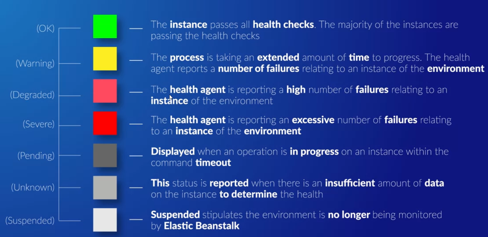

# Elastic Beanstalk (EBS)

- Takes uploaded code and provisions/deploys required resources for your application
- Resources can include EC2 instances, auto scaling, health-monitoring, and Elastic Load Balancing
- Useful for developers who aren't familiar with provisioning the correct environment and resources for an application.
- Works with a variety of platforms and programming languages
- Beanstalk itself is free to use; **however,** you must pay for any resources that are created/used (i.e. EC2 instances)
- If needed, can customize your EBS deployments by adding JSON/YAML to a `/.ebextensions/*.config` file

## Components and Definitions

**Application Versioning**
- Beanstalk can manage application versions
- Each version typically points to an S3 bucket
- _NOTE_: "application versions" are not the same as "applications" (see below for more)

**Environment**
- An application version that has been deployed on AWS resources
- An environment contains **ALL** of the resources created by Beanstalk (not just the EC2 instance)

**Environment Configuration**
- Can configure what resources are provisioned for the environment

**Environment Tiers**
- Web Server environment - for handling HTTP traffic
	- Uses the following AWS components
		- Route 53 - to direct web traffic
		- ELB - to distribute traffic and scale resources
		- Auto Scaling - also to scale resources
		- EC2 instances - part of the auto scaling group for your ELB, must have at least 1 instance (what else is going to run your web server here?)
		- Security Groups
		- **Host Manager**
			- Installed on every EC2 instance provisioned
			- Helps in application deployment
			- Collects metrics and events from EC2 instance
			- Generating instance-level events
			- Monitor both application log files and the server itself
			- Patch instance components
			- Manage log files, allows them to be published to S3
- Worker environment - for all other use cases, such as long-running tasks

**Platform**
- Configures the OS, programming language, server type, and other components of Beanstalk

**Application**
- Collection of environments, environment configurations, and application versions
- An application can contain _multiple_ application versions

## Environment Tiers

### Web Server Tier

For a website, web app, or REST servers

Uses the following AWS components
- Route 53 - to direct web traffic
- ELB - to distribute traffic and scale resources
- Auto Scaling - also to scale resources
- EC2 instances - part of an auto scaling group, must have at least 1 instance (what else is going to run your web server here?)
- Security Groups - for ec2 fleet, by default, port 80 is allowed
- **Host Manager**
	- Installed on every EC2 instance provisioned
	- Helps in application deployment
	- Collects metrics and events from EC2 instance
	- Generating instance-level events
	- Monitor both application log files and the server itself
	- Patch instance components
	- Manage log files, allows them to be published to S3

### Worker Tier

For use cases outside of "Web Server Tier", like long-running background tasks

Uses the following components
- SQS Queue
	- If you don't have an SQS queue, then Beanstalk will create one for you
- IAM Service Role - allows EC2 instances to monitor queue activity in the SQS queue by granting the following actions
	- `sqs:ChangeMessageVisibility`
	- `sqs:DeleteMessage`
	- `sqs:RecieveMessage`
	- `sqs:SendMessage`
- Auto Scaling
- EC2 instances - attached to the auto scaling group

## Deployment Options

**All at Once** - default option, rolls out new deployment all at once, which can affect availability of your service

**Rolling** - If your deployment is in multiple batches, EBS will update one batch at a time before moving onto the next
- Example: your deployment has 3 batches, then 1 batch is taken down for updating while the other 2 are unchanged

**Rolling with Additional Batch** - deploys an additional, temporary batch and begins a rolling deployment; when
all other batches are updated, the temporary batch is destroyed
- Example: your deployment has 3 batches, then 1 extra batch is created so all 3 batches are still available

**Immutable** - creates a new set of instances served through a temporary autoscaling group behind ELB
- Old environment is removed when new environment is ready

## Health Reporting

2 types - basic (free) and enhanced (paid)

Basic Health Reporting
- Every 10 seconds, ELB will health check every instance in the auto-scaling group and wait for a response to confirm its health
- Two types of health checks
	- System Status Check - if this fails, then there's likely an issue with the underlying host (not your responsibility)
	- Instance Status Check - if this fails, then there's an issue with your instance (i.e. network config, corrupted file systems, low ram)
- Checks other things
	- If auto-scaling group is present, then it has a least 1 healthy instance
	- If Route 53 is used, then ensures the C-name record is redirecting to the correct ELB
	- Ensuring port 80 inbound is allowed (for web server)
	- Ensuring SQS queue is polled every 3 minutes (for web worker)
- Provides the following health indicators
	

Enhanced Health Reporting
- More granular data
- EC2 instances have a health agent (only supported for some AMIs) which allows EBS to capture more system metrics and logs
- All additional data collected (compared to Basic plan) can be sent to CloudWatch, but is an additional cost
- Health indicators are more specific and detailed
	

## General Workflow

1. Create your application (i.e. code it!)
2. Upload the version to Beanstalk
3. Launch the environment
4. Manage your environment as necessary
	- Deploying a new application version
	- Updating the environment itself, which will re-launch the environment (i.e. it might need to create/delete/modify resources)
