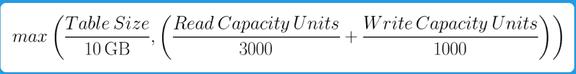

# DynamoDB (DDB)

- TODO Given a GSI that has primary and range key, is the range key required when inserting/updating a record into the table
- TODO Given an LSI, is the range key required when inserting/updating a record into the table?

Services for NoSQL databases/key-value stores
- Look up data via primary key or through indexes
- High performance, single-digit ms latency
- Storage automatically grows, so you don't have to scale it
- Performance is consistent, no matter how large your table grows
	- Contrasted with relational databases, these slow down as tables grow

Pricing is based on
- Amount of storage
- Total throughput you configure (doesn't matter if you don't use it all) or on-demand throughput

Can encrypt data at rest via
- A key owned by AWS DDB (no charge)
- KMS - Customer managed CMK (a key stored in your account that you manage)
- KMS - AWS managed CMK (a key stored in your account, but managed by AWS, charges apply)

## DynamoDB Accelator (DAX)

In-memory cache for DDB that delivers up to 10x performance improvement
- _Microsecond_ latencies, even at 1M req/s
- Not useful if requests require strong consistency or transactions

## Pros vs Cons
Pros
- Fully-managed
- Schemaless
- Highly available
- Super fast
Cons
- There are no alternatives or on-premise solutions for DynamoDB. You must use AWS in order to use DynamoDB.
	- If you need to keep data on-premises, then DynamoDB is not for you.
- Eventual consistency
- Queries are less flexible than with most relational databases. This ensures all queries are as fast as possible
- Maximum record size is 400KB
- Can have up to 20 GSIs and 5 LSIs

# Types of Keys

- Primary/Hash key
- Sort/Range Key

If your table uses a sort key and you are requesting to get a _single_ item (not to be confused with _querying for multiple items_), then you must specify the **primary and sort key** in your request. Otherwise DDB will throw an error
- Similarly, when _creating_ an item, you must provide both keys. (This is not required when updating an item though)

Use case for Primary and Sort Keys
- Highscores/Leaderboards: a username would be the primary key, and a video game title would be a sort key.
- Ordering from online store: order ids would be primary key, line number would be sort key
	- The "nth Line number" refers to the nth item purchased in the order

# Secondary Indexing
- If you want to query and match on 2 different columns, you need an index
- When you want to use an index, you need to explicitly mention that in your request to DDB.

**Global Secondary Index (GSI)** - query across entire table
- Contains a selection of attributes from the base table, but has a primary key that is different from the base table's primary key.
	- Conceptually, think of it as a "new table" with it's own primary and (optional) sort key. In fact, a GSI uses storage that is separate from the main table
- _Attribute projection_
	- When an attribute is projected, then the attribute will also be visible in the queries.
	- If an attribute is not projected on a GSI, you will not see it in the results when you query the GSI.
	- Only the GSI's keys must be projected. Projecting other attributes are optional.
- Data is asynchronously synced from the main table to the GSI
- GSIs are always eventually consistent (unlike the main table, which _can_ be strongly consistent)
- Any attribute that is a key for a GSI **must** be defined when inserting/updating a record
- Any attribute that is a key for a GSI **will** be type checked. Example below
	- A record has `foo` (a string) and `bar` (a number) as attributes.
	- The table's primary key is `foo`
	- Without a GSI, `bar` can technically take on any type it wants (number, string, array, etc).
	- However suppose there's a GSI whose primary key is a number called `bar`. Now, whenever you insert/update a record, the `bar` attribute must be present AND it must be a number.
- Creation/Configuration
	- Can be created at any time
	- Each GSI has it's own throughput (separate from main table) and **must be configured**
	- Up to 20 GSIs per table

**Local Secondary Index (LSI)** - can only find data within a single partition key
- Similar to a GSI, except that you cannot specify a different partition key; that will always be locked to the base table's partition key
- You **must** specify the LSI's sort key
- The attribute to use as the sort key cannot already be a key for the table
	- **TODO** How does this restriction also apply to attributes that are keys for other GSIs or LSIs?
- Supports _attribute projection_
- Supports strong consistency
- Any attribute that is a key for an LSI **must** be defined when inserting/updating a record
- Any attribute that is a key for an LSI **will** be type checked.
- Creation/Configuration
	- Can only be created when the table is created. Otherwise you need to delete and re-create the table.
	- Throughput is shared with main table
	- Up to 5 LSIs per table

# Throughput and Capacity Units (CU)

If you use provisioned throughput and you use up all your read capacity units, you will get an error if you make another read operation. (Same thing for write)
- You can always adjust provisioned throughput at any time.
- If you adjust provisioned throughput, the table will still remain available.

1 Read Capacity Unit allows you to retrieve:
- 1 record per second
- Up to 4KB in size
	- This is rounded up, so a 5KB record would cost 2 RCUs
- With strong consistency (more on this below)
	- Eventually consistent reads cost half as much

1 Write Capacity Unit allows you to store:
- 1 record per second
- Up to 1 KB in size (also rounded up, similar to RCUs)

## Auto-Scaling for Read/Write Capacity Units

RCUs and WCUs can be configured to auto scale with demand
- Can configure to scale only RCUs, only WCUs, or both
- Configure a target utilization
	- When exceeded, more capacity units are increased
	- When below this threshold, capacity units are decreased
- Configure minimum and maximum provisioned capacity

For each RCU and WCU, you can choose whether to apply these same auto-scaling settings to global secondary indexes

# Queries

**Query** searches the table for a single partition key
- Can return a single record if the table is not using sort keys
- If using sort keys, multiple records may be returned from the query

Queries can be strongly or eventually consistent
- Strongly consistent will check all three replicas of the table in different AZs, and sends back the most recent version of the data
- Eventually consistent will fetch data from one replica, so as a result it may not be the most recent version of the data.

In the case of tables with sort keys
- Results can further be filtered out
	- Numerical comparisons:
		- `sort key > 50`
	- String comparisons:
		- `sort key between "Jackson" and "James"`
		- `sort key begins with "Ross"`
- Results can be ordered by sort key

Results can be filtered even further on _any_ attribute; however, this can cost more RCUs
- DDB will always search for records by the partition key first, apply sort key filters, and then apply filters on other attributes.

# Scans

**Scans** search across ALL partition keys and can return multiple records (this contrasts with **queries**)

Scans **don't** require a partition key in the request
- As a result, your scans can cost more RCUs than queries.

Scans can be filtered on any attribute

Scans **cannot** be ordered

Scans are always **eventually consistent**

Scans can run in parallel

# Partitioning

DynamoDB's performance can be attributed to the way it **partitions** the table. A table partition refers to a segment or portion of the table, which will contain some of the table's records. This is why a **partition key** is necessary, because DynamoDB maps partition keys to one of the physical partitions of your table.
- You cannot see how many partitions your table has
- You cannot directly interact with any of the physical partitions
- You cannot determine which physical partition a record resides in
- Your read and write capacity units are **split equally amongst each partition**
	- If you have 200 RCUs, and 10 partitions, then each partition has 20 RCUs

There is a formula for how many partitions your table _may_ have:

Typically, the number of partitions is a power of 2.

What happens when a partition (call it `A`) grows too large?
- `A` will split into two partitions, `B` and `C`
- Once the data has finished migrating to the new partitions, `A` will be removed
- If `B` grows too large, then `B` will split into `D` and `E` (note that `C` is **not** split up)

When does re-partitioning occur?
- Usually when the partition grows past 10GB in size.

What's wrong if we have too many partitions?
- This can lead to your workload not being evenly distributed across the partitions. More on this below.
- Keep in mind that RCUs and WCUs are split _equally_ amongst each partition

## Balancing Partitions in Large Tables

The best way to balance partitions is to use a good partition key (hmm..., the floor is made out floor...)

If you have a partition that's significantly larger than the other partitions, then your RCUs and WCUs aren't evenly distributed across your partitions.
- Say you have 4 partitions `A` thru `D`
- Partitions `A` thru `C` have 5 records
- Partition `D` has 100 records
- Because `D` has more records than the other partitions, then a lot of requests will likely end up going to `D`.
- This means that RCUs/WCUs for `D` are more likely to run out. When this happens, reads and writes **stop functioning in that partition**
	- AWS does provide a free amount of **burst capacity**, which allows you to use more RCUs/WCUs than provisioned (and thus, read/writes to `D` can still continue)
	- **However**, you cannot rely on this because AWS also uses burst capacity units for background maintenance tasks
