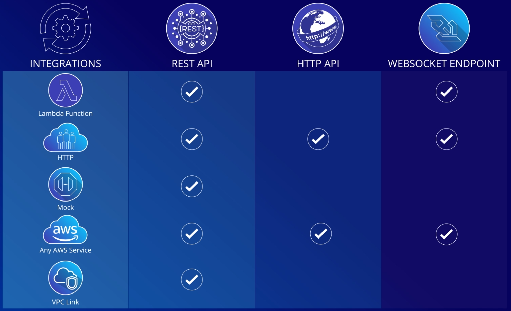
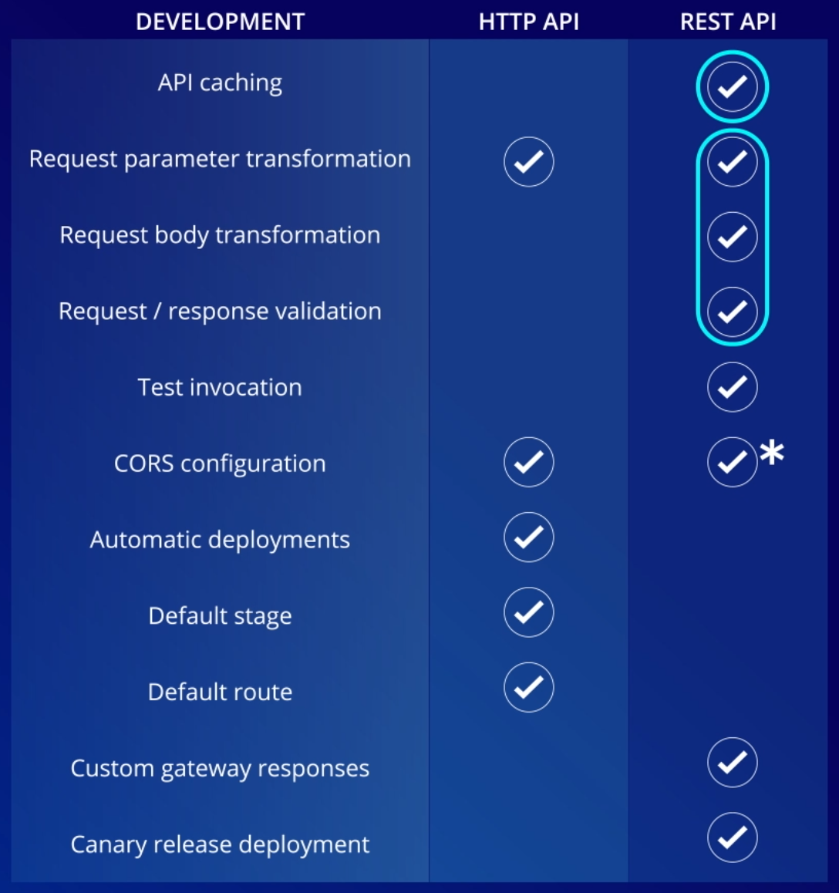

# API Gateway

Allows you to define and model a RESTful API without having to manage a lot of code associated with it (i.e. writing a REST server in C, Java, Python, etc).

Allows you to map API endpoints via **mapping templates**

Integrates with Lambda functions
- Here, "method" refers to `HTTP_METHOD /foo/bar`
- A method can invoke a lambda
- Can also map multiple methods to invoke the same lambda

Supports serverless functions, generic web apps, and containerized workloads

Resources can have dynamic query parameters
- Example: `GET /items/{id}`, where `{id}` defines the query parameter `id`

## Components

**Models**
- Defines object schemas (one supported schema format is JSON schema)

**Resources**
- Defines a route or endpoint (i.e. `/items/`)
- Does not specify an HTTP method (that's next...)
- Resources can have **child resources**; useful for dynamic query params (i.e. `/items/{id}`)

**Methods**
- Responsible for bulk of the business logic in API Gateway
- For a given resource, defines an HTTP method to perform some action
	- So the resource `/items` could have 1 or more methods, say GET, POST, etc.
- When a method is created, you can mock responses from it by modifying the "Integration Response"
	- Can hard-code some static responses
	- Can generate responses based off model schemas that you have defined in your API Gateway

## Endpoint Types

#### Edge Optimized Endpoint
- Best when you have many geographically distinct and distributed clients
- Helps reduce TLS connection overhead, and thus overall latency

#### Regional Endpoint
- Bet when you are expecting calls to come from a single region
- Works well when you plan to use a non-AWS CDN

#### Private Endpoint
- Can only be accessed from within VPC via an **Interface VPC Endpoint**
- Best for internal APIs
- Lots of control over networking configuration to help with security

## Supported API Protocols

#### HTTP API vs REST API

Keep in mind HTTP is not the same as REST

**REST API** is older, and designed to deal with all aspects of the API lifecycle
- Offers management features like usage plans, API keys, and publishing and monetizing your API
- Best for customers wanting to pay a single price point for a lot of management features

**HTTP API** is newer and optimized for building APIs that proxy to AWS lambda functions and generic HTTP backends
- Does not have as many QoL features as REST API
- Around 70% cheaper than REST API
- Best with APIs equipped with OIDC and OAuth-2
- Best with workloads that scale very large
- Best for latency-sensitive workloads

#### Websocket API

Completely different than HTTP and REST API

Relies on **duplex communcation** - where a connection is persisted between two parties and can send messages to each other

Great for real-time apps (i.e. streaming services, online games, chat rooms)

Requires a good connection

## Integration Setup with Backend

#### Proxy Integration

**Proxy integration** is a _pass-through setup_ where the gateway passes the request straight to the backend, without modifying anything along the way
- Easy to setup
- Great for rapid development

#### Direct Integration

**Direct integration** allows you to _modify_ the client request _and_ server response as it passes through the gateway
- More effort to setup
- Completely decouples API Gateway from the backend's request and response payloads, headers, and status codes
- Allows you to make changes and not be locked into the backend service's responses

## Integration Types

**Lambda Functions** - proxy or direct

**HTTP Integration** - proxy or direct
- Points to a public facing endpoint
- All data is passed through (requests and responses)

**Mock Integration** - direct only
- Allows gateway to generate a response without an actual backend
- Good for testing

**AWS Service Integration** - direct only
- Allows you to respond with an AWS Service API response
- Gateway will invoke a specific AWS service API for you (i.e. sending a message to SQS or putting an object in an S3 bucket)
- Great when you want users to have _limited_ access to the AWS API

**VPC Link Integration** - direct only
- Allows you to access private resources within a VPC

**Supported Protocols for each Integration Type**

## Gateway Authorizers

#### IAM Authorizer

- Available with HTTP, REST, and Websocket APIs
- Allows you to create unique credentials to distribute to your API clients
- Requires a Signature Version 4 signed request from client
- Requires client to have `Execute-API` permissions

#### Lambda Authorizer

- Available with HTTP, REST, and Websocket APIs
- A lambda is executed and runs a custom authorization model
- Good if you use a 3rd party or legacy authorization system

#### Cognito Authorizer

- Available only with REST API
- Direct integration to Amazon Cognito user pools, so you have complete user management
- Access to long pages, MFA authorization, user info

#### JWT Authorizer

- Available only with HTTP API
- Use any service that is OAuth2 compliant
- Use any service that has OIDC (OpenID Connect)
  - As a result, you can actually use Cognito here. So in a way, Cognito authorization is possible with REST _and_ HTTP APIs

## Gateway Security

Integrates with WAF to help protect your API
- Protects against DDOS, SQL injections, cross-site scripting, and more
- Can block range of IP addresses, or even entire countries and regions

## Metrics and Monitoring

`4XXError` - number of 4XX errors

`5XXError` - number of 5XX errors

`CacheHitCount` - number of requests served from cache

`CacheMissCount` - number of requests served from backend, given API caching is enabled

`Count` - number of request

`IntegrationLatency` - time between when gateway relays a request to the backend and when it receives a response

`Latency` - time between when gateway receives request from client and returns a response back to client
- Includes time from `IntegrationLatency` by definition

## Choosing between HTTP and REST API

Authorizer
- Cannot use JWT Authorizer with REST API

Integration
- Reminder, private integration with NLBs _are supported for both_ HTTP and REST API
- Cannot use private integrations with ALBs with REST API
  - To work around this, Amazon says to use a VPC Link to first connect to a private NLB. Then use the NLB to forward API Gateway requests to the private ALB.

API Management
- Cannot make usage plans or API keys with HTTP API
- HTTP API does support custom domains, however it only supports TLS 1.2 for encryption. REST API supports TLS 1.3

Security
- HTTP and REST both support mututal TLS authentication
- HTTP does not support
  - Certificates for backend authentication
  - AWS WAF
  - Resource policies

Monitoring
- HTTP and REST both support
  - Access logs in Amazon CloudWatch
  - CloudWatch metrics
- HTTP does not support
  - Access logs in Amazon Kinesis Data Firehose
  - Execution logs
  - AWS X-Ray

Development and other features
- HTTP API does not support
  - API caching
  - Request or response transformation
  - Test invocation
  - Custom gateway responses
  - Canary release deployments
- REST API does not support
  - Automatic deployments
  - Default stages
  - Default routes

## Usage Plans, API Keys, and More

Can specify **usage plans** to limit/throttle your API

Methods on resources have the option to require API Keys

Can add **API keys** to your gateway, and **assign usage plans to each API key**
- Use case: Alice may need to use the API more often than Bob does. So Alice's API key may have a more generous usage plan, while Bob's API key might have a more strict usage plan

Can throttle for different stages (i.e. dev, test, prod)

Can configure CORS, so that your API only makes HTTP requests to certain domains or origins

Can enable caching
- **Only available for REST API**, not available for HTTP or Websocket APIs
- Max cache size; larger sizes cost more
- Whether to encrypt cached data
- How long cache lives for (TTL)
  - Default is 300 seconds, but can range from 0 to 3600 seconds
- Whether it requires authorization and how to handle unauthorized requests
