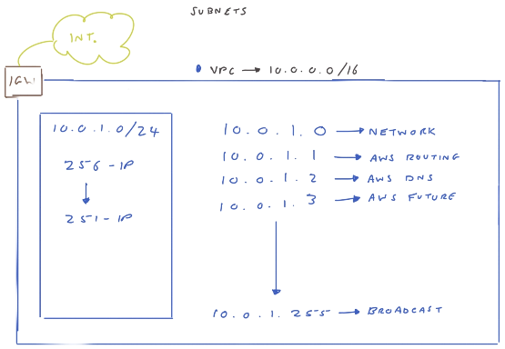
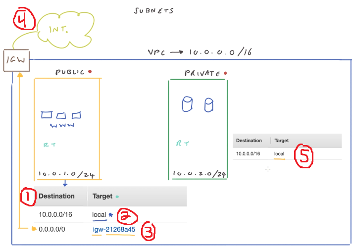
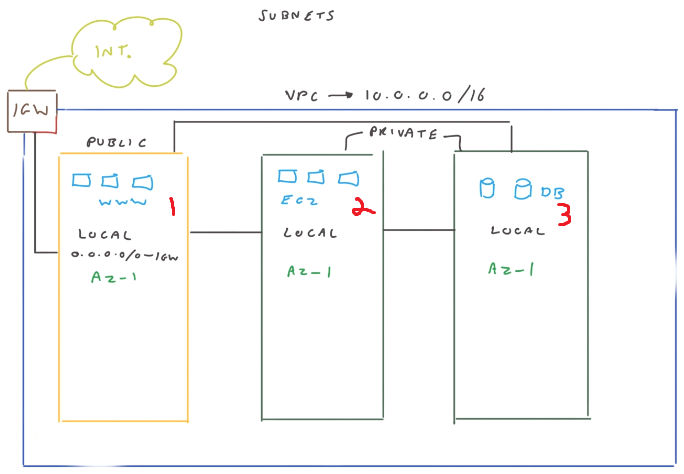
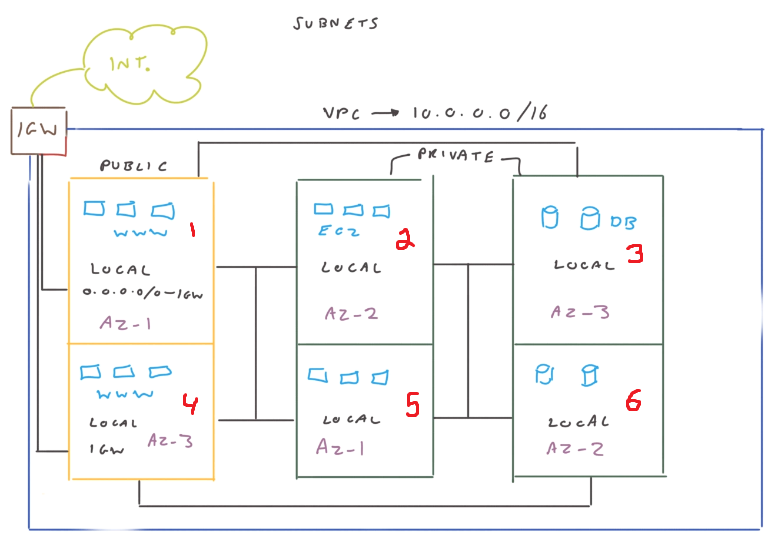

# Virtual Private Cloud (VPC)

A VPC is an isolated network that resides within AWS
- By default, only your AWS account has access to a VPC when created
- Up to 5 VPCs per region per account
- Creating a VPC requires a name and a **CIDR block address** (see below)

## CIDR Block Address

**CIDR Block Addresses** define a range of IP addresses

Suppose your CIDR block is `10.0.1.0/24`
- `10.0.1.0` is the starting IP address for this IP range
- `/24` defines your **subnet mask**
	- A **subnet mask** determines the **total number of IP addresses** in this range
	- **However,** the total # of addresses **IS NOT** the same as the total # of _usable addresses_ (see below)
	- The subnet mask is 4 bytes long (32 bits)
	- The number `/24` refers to **how many consecutive 1s there are in this subnet mask**, starting from the left-hand side
	- So in this case, subnet mask is `255.255.255.0`, which means that there are a total of 256 addresses
	- Or expanded in binary: `11111111.11111111.11111111.00000000`
	- EX) If it were `/21`, what is the subnet mask? How many total IP addresses are there?

In an AWS CIDR block, there will be 5 reserved IP addresses.
- Using the diagram as an example, we can determine these reserved addresses.
- We have a total of 256 addresses
	1. `10.0.1.0` is a network address
	2. `10.0.1.1` is for AWS routing
	3. `10.0.1.2` is for AWS DNS
	4. `10.0.1.3` is for future use
	5. `10.0.1.255` is the broadcast address
- So we have 251 total **usable** addresses

# Subnets

Subnets reside in a VPC, and allow you to segment your VPC into multiple networks
- Subnets must reside within the VPC's CIDR block range

1. This is a **routing table**, which defines where requests are directed
2. For the public subnet, the first row shows `10.0.0.0/16 | local`, which indicates that any requests in this IP range are to be directed within the VPC (aka the target)
	- This means all subnets _within the same VPC_ can communicate with each other
	- This route cannot be deleted or modified; it is there by default
3. For the public subnet, the second row shows `0.0.0.0/0 | igw-someid`, which indicates that for all other IP addresses that don't match any other destination in the routing table, then forward the request to the  Internet Gateway (aka the target)
	- **Note:** This is not done by default! You have to add this routing and the internet gateway in order for your subnet to talk to the public internet.
4. The Internet Gateway is what allows a subnet to connect to the internet
5. For the private subnet, the routing table only directs traffic within the VPC

## Route Tables

Route tables can be assigned to many subnets.

However, a subnet can only have 1 route table.

## Building Resiliency with Subnets and AZs

### Scenario 1: Resources deployed in single AZ

- We have a VPC network that has 3 subnets, 1 public and 2 private
- All of our resources are deployed in the same AZ: `AZ-1`
- Suppose `AZ-1` fails/goes down, then all of our resources also go down

### Scenario 2: Resources deployed in multiple AZs

- We have a VPC network that has 3 subnets, 1 public and 2 private
- Unlike Scenario 1, our resources are deployed across multiple AZs: `AZ-1`, `AZ-2`, and `AZ-3`
- Suppose `AZ-1` fails
	- That means our web app `(1)` and EC2 instance `(5)` go down
	- Web app is still available though, because it is also deployed in `AZ-3` (see `(4)`)
	- EC2 instance is also available, because it's deployed in `AZ-2` (see `(2)`)
- EX) When `AZ-2` fails, which resources go down? Are there any components (i.e. a web app) that are no longer reachable?
- EX) When `AZ-3` fails, which resources go down? Are there any components (i.e. a web app) that are no longer reachable?
