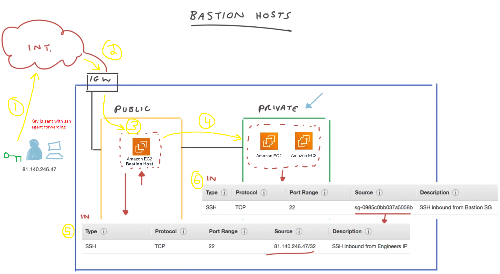
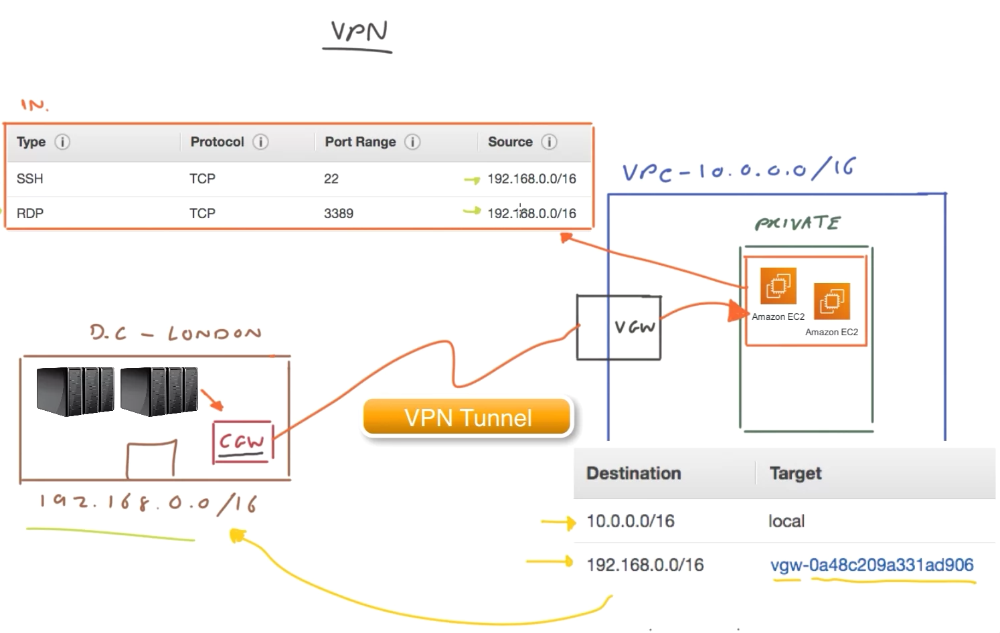
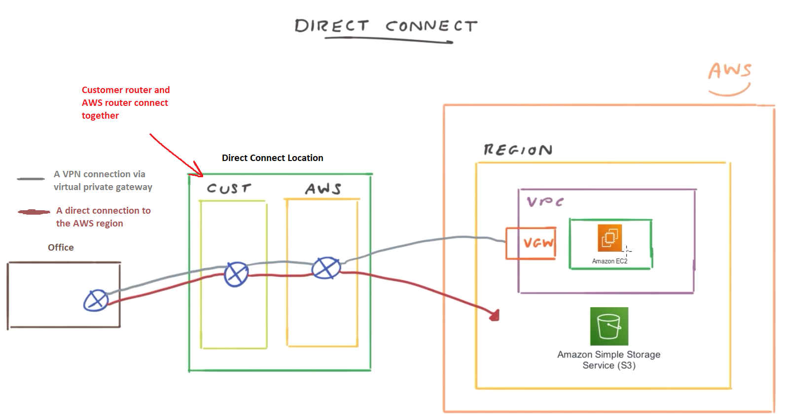
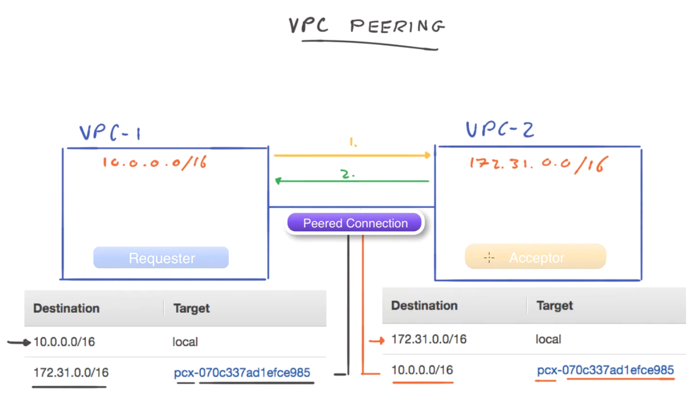
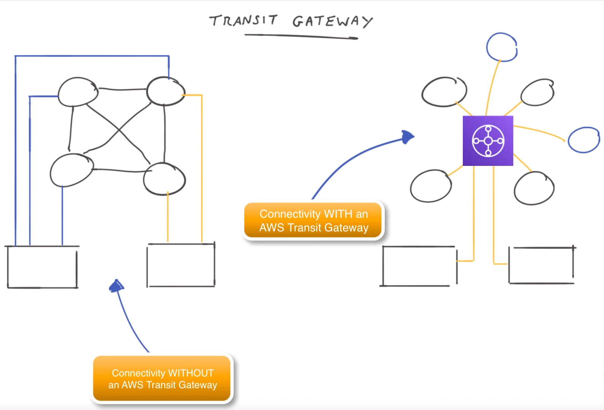

# VPC Security and Control

## Network Access Control Lists (NACL)
A **network access control list (NACL)** are virtual network-level firewalls that are associated to **every subnet**
- NACL **operates at the subnet and network layers**
- Help control traffic coming in and out of your VPC and between your subnets
- By default, a NACL allows all traffic both inbound and outbound. _This is not very secure_
- NACLs are **stateless**, which means that any response traffic generated from a request must be explicitly allowed in either the **inbound or outbound ruleset**
- You can have the same NACL applied to multiple subnets, but only 1 NACL can be associated to 1 subnet

1. Inbound rule #10 allows TCP traffic on port 80 from any source
2. Inbound rule #20 allows TCP traffic on port 443 from any source
3. Inbound rule `*` DENIES ALL other traffic.
	- This is known as a **cover rule**
4. Outbound rule #10 allows all traffic on any port to be sent to any destination
5. Outbound rule `*` _is supposed to_ deny all traffic going out. However, since outbound rule #10 captures all destination addresses, this **cover rule** does not capture any addresses
6. These are the **inbound and outbound rulesets**. Notice how for inbound rulesets, we have "Source" addresses; and for outbound rulesets we have "Destination" addresses

## Security Groups
Similar to NACLs; they filter traffic going in/out. **However,** a NACL operates at the subnet level, while a **security group operates at the instance level**.
- Traffic rules apply in this order: `NACL --> security group`
- Example 1
	- Configuration: NACL denies inbound TCP port 80, security group allows inbound TCP port 80
	- Result: all inbound TCP port 80 traffic is denied at subnet level by NACL
- Example 2
	- Configuration: NACL allows inbound TCP port 80, security group denies inbound TCP port 80
	- Result: all inbound TCP port 80 traffic is allowed at subnet level by NACL, but security group denies the traffic
- Example 3
	- Configuration: NACL allows inbound TCP port 80, security group allows inbound TCP port 80
	- Result: all inbound TCP port 80 traffic is allowed at subnet level by NACL, and security group also allows this traffic

Unlike NACLs, security groups are **stateful**
- If you send a request from an instance, the response traffic for that request is allowed to flow in regardless of inbound security group rules.
- [See this post](https://stackoverflow.com/questions/53622935/what-is-meant-by-security-groups-are-stateful)
- Example
	- There are two resources `A` and `B`, both on different subnets `SubnetA` and `SubnetB`
	- A security group is configured on `SubnetA` as follows:
		- `SubnetA` is allowed to send TCP traffic on port 80 to `SubnetB`
		- `SubnetA` is DENIED to receive TCP traffic on port 80 from `SubnetB`
	- Resource `A` is allowed to send a TCP request on port 80 to resource `B`, **and** as a result `A` is allowed to receive a response back. However, if `B` were to send TCP traffic on port 80 to `A`, then it would be denied
	- If we used this configuration with just a NACL and no security group, then ALL inbound TCP port 80 traffic will be denied, regardless of whether it is a request or response

## NAT Gateway
- Deployed inside a public subnet
- Allows private subnets to send requests to public internet, but denies connections _initiated from the internet_ (aka a request coming _into_ your private subnet)
- Setup a route in your routing table such that if the IP destination is `0.0.0.0`, then the request is routed to the NAT gateway in your public subnet
	- Using `0.0.0.0` as the destination filter indicates all other IPs
- Under the hood, AWS will deploy multiple NAT gateway instances for resiliency, but you only see 1 gateway
- NAT gateways are setup manually
	- If you have multiple public subnets in different AZs, then you have to setup a NAT in each of those subnets

## Bastion Host
Scenario: Suppose you have EC2 instances that sit in a private subnet, but you want to access them from your home office.
- By design of private subnets, it is not possible to access these EC2 instances (unless you attach it to an internet gateway, in which case it's now a public subnet...)

A **bastion host** helps achieve this, which is an EC2 instance that sits inside the public subnet and **provides secure access to Linux instances in both your private and public subnets**

1. You send your public key via SSH Agent forwarding over public internet
2. Public internet connects to IGW
3. IGW allows connection since it is TCP port 22 coming from a particular source IP. IGW then allows connection to the bastion host (see security group in #5)
4. Bastion host sends public key EC2 instances in the private subnet, which is allowed by the security group in #6
	- This security group allows TCP 22 inbound coming from the security group in #5

## VPN (Virtual Private Network)
A **VPN** is a secure way of connecting two remote networks across the internet (i.e. between a VPC in AWS and a gateway in your office)
- An endpoint is needed in your office, known as the customer gateway
- Setup a **virtual private gateway** in your VPC
	- Must be configured to allow traffic from your office's endpoint
- Once these two gateways are setup, a VPN tunnel can be setup between them. However, only the customer gateway can initiate the tunnel; it cannot be initiated by the virtual gateway sitting in your VPC
	- The tunnel connection can timeout after inactivity
- Suppose you want to access resources in a private subnet. There are two ways to achieve this:
	1. Configure subnet's routing table to route the customer gateway's IP address to the virtual gateway
	2. Enable route propagation on the subnet's routing table, which will automatically add routes for your VPC connection. **However**, this is only possible if the customer gateway supports dynamic routing

Once you have setup the virtual private gateway and customer gateway, you also have to configure your security groups

## Direct Connect
A **direct connection** does not traverse the public network, and instead relies on private infrastructure
- A VPN is different because it establishes a secure connection over the public internet

## VPC Peering
**VPC Peering** allows you to securely connect two VPCs together
- Peering **will not work** if the CIDR blocks of the VPCs overlap
- Peering connections are **1-1** or **not transitive**.
	- Suppose VPC1 and VPC2 have a peering connection, and VPC2 and VPC3 also have a peering connection
	- VPC1 cannot access resources in VPC3. If it wants to, it must have a peering connection setup directly with VPC3.

### Peering Process
1. VPC1 sends request to VPC2
2. VPC2 acknowledges request, and a **peered connection** is established
3. Make sure each subnet's routing table is configured to allow traffic between each other, as shown below

## Transit Gateway
A **transit gateway** allows you to connect VPC and remote locations to **a single central hub**.
- Because the transit gateway acts as a central hub, it also centralizes all of your monitoring (such as network traffic and connectivity)

- On left side (without transit gateway)
	- 4 VPCs (circles) that all communicate with each other
	- 2 remote locations (rectangles) that connect to VPCs via VPNs (blue lines) and Direct Connect (yellow lines)
- On right side (with transit gateway)
	- 4 VPCs and 2 remote locations all connect to the transit gateway
