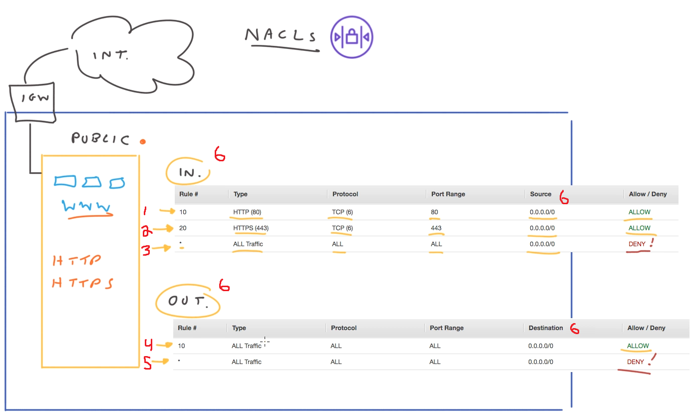

# VPC Security and Control

## Network Access Control Lists (NACL)

A **network access control list (NACL)** are virtual network-level firewalls that are associated to **every subnet**
- Help control traffic coming in and out of your VPC and between your subnets
- By default, a NACL allows all traffic both inbound and outbound. _This is not very secure_
- NACLs are stateless, which means that any response traffic generated from a request must be explicitly allowed in either the **inbound or outbound ruleset**
- You can have the same NACL applied to multiple subnets, but only 1 NACL can be associated to 1 subnet

1. Inbound rule #10 allows TCP traffic on port 80 from any source
2. Inbound rule #20 allows TCP traffic on port 443 from any source
3. Inbound rule `*` DENIES ALL other traffic.
	- This is known as a **cover rule**
4. Outbound rule #10 allows all traffic on any port to be sent to any destination
5. Outbound rule `*` _is supposed to_ deny all traffic going out. However, since outbound rule #10 captures all destination addresses, this **cover rule** does not capture any addresses
6. These are the **inbound and outbound rulesets**. Notice how for inbound rulesets, we have "Source" addresses; and for outbound rulesets we have "Destination" addresses
