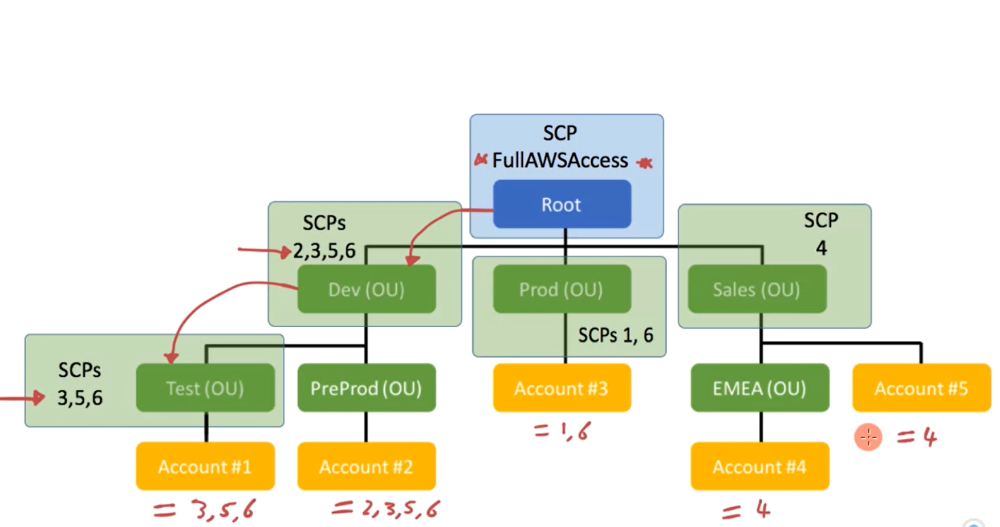
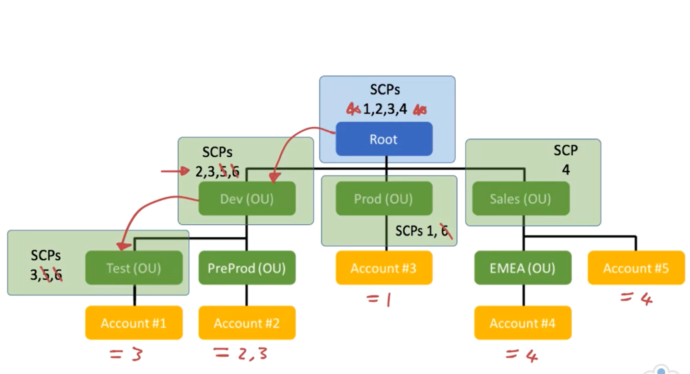

# AWS Organizations

Utilizing AWS organizations can help you with
- Cost optimization and billing
- Security and governance
- Management and control of workloads
- Resource grouping
- Defining business units

Components of AWS Organizations
- Organizations - each org contains exactly 1 root
- Root - resides at the top of your organization's hierarchy
- Organizational Units - helps categorize your accounts
	- Can be underneath the root or another OU
	- Can nest up to 5 times (i.e. be a child of another OU)
- Accounts
- Service Control Policies - determines what services and features are available (but remember that it **does not grant any access**)
	- SCPs do not affect the following
		- Resource-based policies
		- Actions performed by master account
		- Service-linked roles
		- Managing CloudFront keys
	- Can only be used in an organization **if the root account of that org has this setting enabled**
	- Master account of org must then have the following permission to manage SCPs:
		- `organizations:EnablePolicyType`
		- `organizations:DescribeOrganization`
	- SCPs affect all users and roles, including root user
	- If you disable SCPs in an org, then all SCPs in that org are **deleted and removed**

**Benefits**
- Better Account Management
	- Can manage multiple accounts from a single **master** AWS account (see more [below](#implementing-aws-organizations))
	- Can invite existing accounts to an organization
	- Create new accounts directly from master account
- Greater Control of AWS Environment - by leveraging SCPs and OUs, granular control down to specific API calls that users can make
- Consolidated Billing
- Categorizing and Grouping Accounts - by leveraging OUs and service control policies

## Implementing AWS Organizations

Master account **should not create resources**; instead it should primarily be used for:
- Creating/removing accounts in an organization
- Inviting accounts to org
- Apply SCPs to org
- Managing OUs within an org

Organization Types
1. All Features
2. Only Consolidated Billing

## SCP Inheritance
Example 1

Example 2

## Web Application Firewall (WAF)
[See WAF](/security/waf.md)

## Firewall Manager
[See Firewall Manager](/security/firewall-manager.md)

## Shield
[See Shield](/security/shield.md)

## Amazon Inspector
Lets you analyze deployed EC2 instances to identify potential security issues

Provides a knowledge base of with rules that are mapped to common security compliance standards

Can install a **security agent** in the OS of your EC2 instance to monitor network, file, and process activity

Automated Continuous Scanning
- Performed on new and existing resources
- Scans occur when a change takes place

## Amazon Guard Duty
Intelligent threat detection service that provides accurat ways to consistently monitor and protect AWS accounts and workloads

Leverages machine learning models to identify suspicious behaviors from both users and resources
- Looks at CloudTrail logs, VPC Flow logs, and DNS query logs
- Also learns from false positives

Automated
- Continuously monitors for suspicious activity, generates reports, and displays them on **AWS Security Hub**

## Amazon Macie
Uses machine learning to discover and analyze sensitive data stored in S3 buckets
- PII (names, addresses, credit cards, etc)
- API keys
- Credentials

Tracks changes to buckets and only evaluates new or modified objects in future scans

Scans are run automatically and displayed on **AWS Security Hub**
- Can also run manual scans
