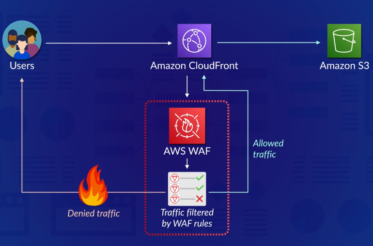

# WAF

Helps prevent ebsites or web apps from being maliciously attacked or exploited by common web attack patterns (i.e. SQL injection, cross-site scripting)

Interacts with following services to filter out harmful inbound requests
- API Gateway
- CloudFront
- Application Load Balancers
- AppSync

## Components
- Web ACLs (Access Control List)
- Rules
- Rule groups

### Web ACLs
- Building block of WAFs
- Contains rules that take action on an inbound request
- When a request does not match any rule, then the ACL can default to either allow or deny the request

### Rules
- Contains statements and criteria that can match a request
- When a request is matched, the request can either be
	- Allowed - forwarded to the resource
	- Blocked - request is dropped and bad response is sent back
	- Counted - counts the number of matching requests

Rule Types
- IP set
- Rule builder - create a custom rule
- Rule group - use a rule group to act as a single rule

### Rule Groups
- Collection of rules that you can apply to different Web ACLs
- WAF has pre-configured groups for common web attacks
- Can find rule groups on AWS marketplace

## Web Capacity Units (WCUs)

Each Web ACL has a limit of 1500 WCUs (web capacity units)
- WCUs control the amount of resources needed by WAF to run your rules
- WCUs are consumed by rules and rule groups
- More intricate and complex rules consume more WCUs

When creating a rule group, you must specify an _immutable capacity_. Rule groups cannot consume more capacity in a Web ACL than their _immutable capacity_
- A rule group can belong to multiple Web ACLs.

## Flow of Requests with WAF
**Note:** Although WAF sits in front of your resources, users do not make requests to the WAF itself. See below

Suppose we have a CloudFront distribution with an S3 bucket as its origin. Suppose we protect our CF distro with a WAF
1. A user initiates a request
2. Request is received by CF distro first, and is then immediately forwarded to the WAF.
	- **Important:** The CF distro does NOT do anything else with the request. It must first send it to WAF.
3. Web ACL filters incoming traffic based on rules or groups
4. If the request is denied, then the user receives a denied response
5. Otherwise, if the request is allowed, then the request is sent back to the CF distro. Your distro then serves content from the S3 bucket.
