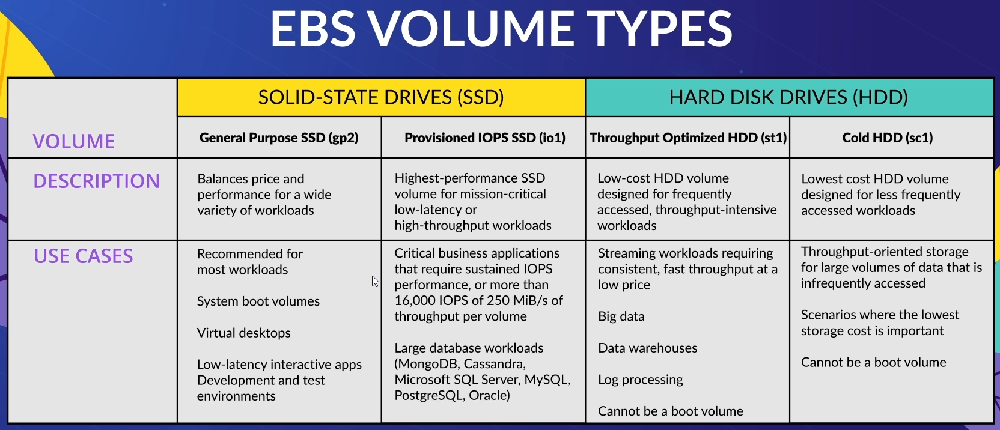

# Elastic Block Store (EBS)
* Persistent and durable block-level storage
* Independent of the EC2 instance that it is associated with
* Logically, not directly, attached to the instance
* An EBS volume can be attached to only 1 EC2 instance. However, an EC2 instance can have multiple EBS volumes attached to it.
* Can create snapshots of an EBS volume either manually or via Amazon CloudWatch
* Snapshots are **incremental** - that is it only copies new or changed data relative to the previous snapshot
* Writes are **replicated multiple times** within the same availability zone
  * Because of this, EBS volumes are only available in a single availability zone. So if that zone fails, then you lose the EBS volume

## Volume Types
* SSD
* HDD

SSDs are better suited for data stored in smaller blocks, whereas HDDs are better for larger blocks of data.

## Security

Data can be encrypted (via AES-256); all you have to do is enable the feature. Internally, the keys are managed by KMS

If a snapshot is created of an encrypted volume, then the snapshot will also be encrypted

### How the encryption works

EBS integrates with KMS to provide encyrption of your volumes.

1. EBS requests a DEK (data encryption key) from KMS
2. KMS generates DEK from the requested CMK
3. CMK encrypts DEK and sends this back
4. Encrypted DEK is stored on volumne as metadata
5. Volume is attached to EC2 instance
6. EC2 asks to decrypt the encrypted DEK from the volume
7. KMS decrypted the encrypted DEK, and sends the plaintext DEK back to EC2 instance
8. EC2 stores plaintext DEK in hypervisory memory _only as long as EBS volume is attached to the instance_
9. EC2 uses plaintext DEK to perform I/O operaton on the volume, but stores data on the volume in encrypted form via AES-256

## Creating Volumes
Can create the volume when you make a new EC2 instance (and thus it'll be attached when that EC2 instance launches) OR you can create it manually in the EC2 dashboard, and then attach it later

Can configure size, volume type, what happens to the volume when it's attached instance terminates, and whether to use encryption.

## Flexible
Ways to change EBS volume storage capacity
* AWS console
* AWS CLI
* Make a snapshot of your current volume, then create a new volume with increased capacity from that snapshot

## Base Use Cases
* Temporary storage
* Multi-instance storage (this is bad because an EBS volume can only be attached to a single instance at a time, and thus can only be accessed by that instance)
* Do NOT expect high durability or availability from an EBS volume
