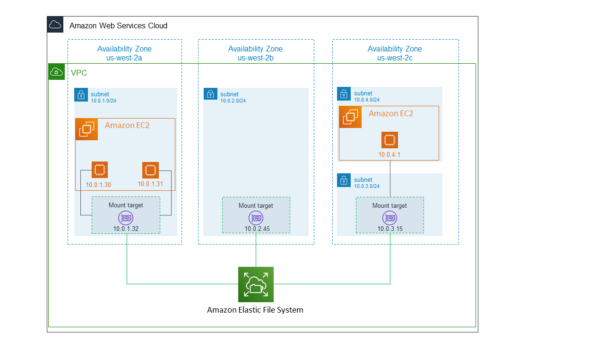
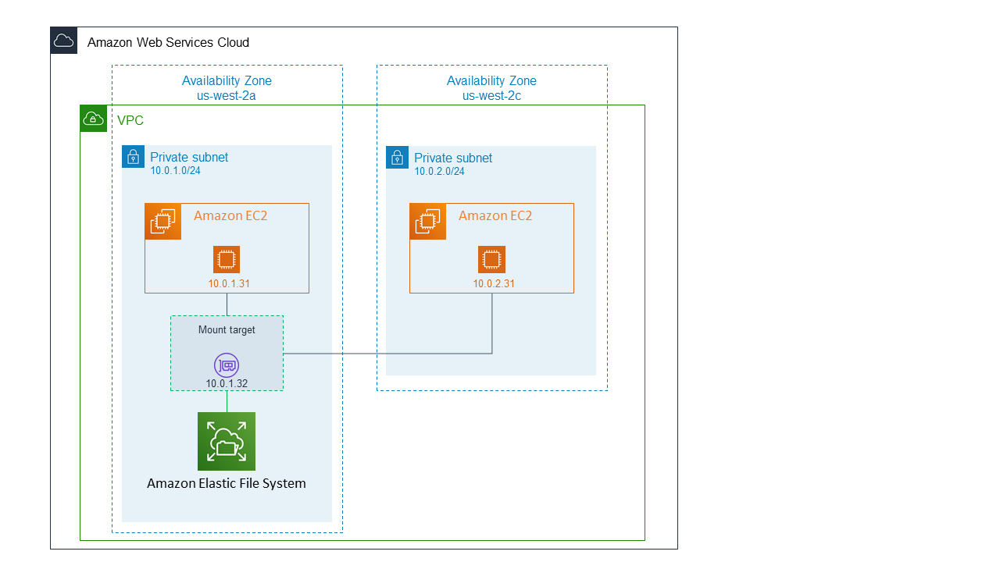

# Elastic File System (EFS)

* Stores files in an actual file system
* Uses standard file system features, such as locking files, updating files, and a hierarchy structure
* Unlike an EBS volume, EFS can be accessed by multiple EC2 instances at once
  * Useful for for parallel access of data
* Optimized for low-latency access
* Fully managed, highly available and durable
* Very scalable (can scale to petabytes)
* Designed to maintain a high-level of throughput
* *Currently not supported on Windows*
* *Currently not supported in all regions*

## Connectivity

EC2 instances *do not* attach or connect directly to your EFS. Instead, the EC2 instances connect to your EFS via **mount targets**.

A **mount target** provides an IP address, which you can use to mount your EFS.
* Must be created in the same VPC as your EFS and EC2 instances
* If your EFS uses Standard storage classes, then there can be *at most 1* mount target per availability zone
* If your EFS uses One Zone storage classes, then you can only use 1 mount target **and** the mount target must be in the same availability zone as your EFS.

See the below diagrams comparing an EFS using Standard storage classes versus using One Zone storage classes:

* EFS with Standard storage class
  
* EFS with One Zone storage class
  
