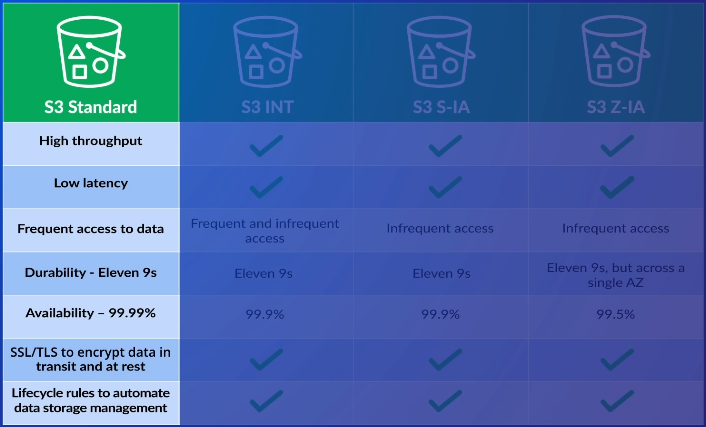
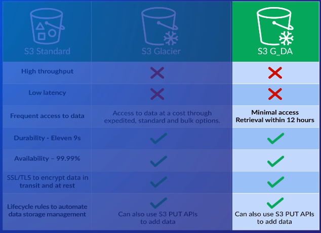
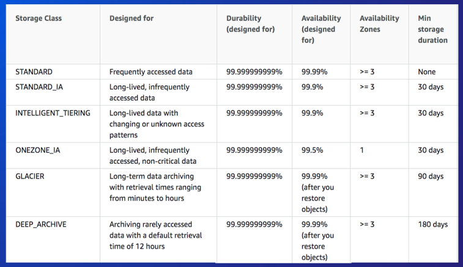

# Simple Storage Service (S3)

* Unlimited **object-based** file storage
* S3 is regional based
* Bucket name must be globally unique
* Supports SSL to encrypt data int transit
* Supports SSE and CSE (server-side and client-side encryption)
* Smallest file size is 0 bytes, largest file size is 5 TB
* Can have up to 100 buckets, but this is a soft limit and can be increased by asking AWS

### Availability vs Durability
* **Availability** refers to the up-time of your data
* **Durability** refers to probability of maintaining data without losing it (i.e. corrupted, data degradation)
  * S3 achieves high durability by replicating your data across multiple AZs (except in the case for "One Zone Infrequent Access" storage class)

## Storage Classes
* Standard
* Standard - Infrequent Access
* Intelligent Tiering
* One Zone - Infrequent Access
  * 20% storage cost reduction because data is not replicated to other AZs
* Glacier
* Glacier - Deep Archive
  - Cheapest option out of all other S3 classes
  - Only has 1 retrieval option, which is retrieving data within 12 hours or less
* Reduced Redundancy Storage (*not recommended*)

**Infrequent Access** classes cost more to retrieve data (hence the name)

**Intelligent Tiering** is used for unpredictable access patterns
* 2 tiers: frequently accessed and infrequently accessed
* Automatically moves data (that is being watched/monitored) into the appropriate tier (frequent vs infrequent tier) based on how often it is accessed
* Additional cost for each object monitored

## Security
* Bucket Policy
* Access Control List (ACL)
* Data Encryption

**Bucket policies** are JSON policies that control access for a specific bucket
* Permissions can be very specific
* Applied at bucket level only

**ACLs** control access for users outside of your AWS account, such as public access
* Permissions are much broader compared to bucket policies
* Some example permissions can be listing or writing objects
* Applied at bucket *and* object level

For **data encryption**, S3 provides server-side encryption (SSE) and client-side encryption (CSE)
* Server-side encryption means the server will encrypt the data after it's uploaded
* Client-side encryption means the data is encrypted *prior* to uploading it to the server
* *Main difference:* where the data gets encrypted

## Data Management
* Versioning
* Lifecycle Rules

Can enable **versioning** in an S3 bucket (disabled by default)
* So multiple versions of an object are stored, and can retrieve any version at any time.
* Once enabled, you ***CANNOT*** disable it. Instead, you can only **suspend** versioning for specific objects
* Additional cost for versioning objects

**Lifecycle rules** automatically manages your data based on a time period
* Time period is configurable (i.e. 30 days, 90 days, etc)
* Once time period passes, then AWS can do the following (but not limited to):
  * Move the data to another storage class
  * Move data to Amazon Glacier
  * Delete the data

## Use Cases
* Backing up data
* Static content/static websites
* Large datasets
* Integration with other AWS services
  * ex) An EBS instance can create a snapshot of itself and saves it in a (hidden) S3 bucket

## Bad Use Cases
* Archiving data
* Data is very dynamic and changes frequently
* Data being stored requires an actual file system (recall that S3 is *object-based* file storage)
* Structured data that needs to be queried

# Amazon S3 Glacier

* Made for long-term, durable storage; also known as **cold storage**
* Storage costs are much cheaper
* Retrieving data can take significantly longer

## Vaults & Archives

An **archive** is like an object in S3: it's just data (music, videos, text, etc).

Archives are then stored in a **vault**.
* Vault can hold unlimited archives
* Vaults are regional

**Note:** Glacier makes use of archives and vaults, not buckets and folders

## Glacier Dashboard

Only allows you to create vaults. You **CANNOT** upload or download any data from the dashboard.

Uploading and downloading archives can only be using code
* Glacier REST API
* AWS SDKs

## Moving Data in Glacier
1. Create a vault
2. Upload data into the vault via the API/SDK or an S3 Lifecycle rule

## Data Retrieval
* Standard
* Expedited (most expensive)
* Bulk (cheapest)

You must submit a retrieval request in order to access your data in Glacier.
* When ready, Glacier will store your data in a temporary object in an S3-RRS or S3-IA storage class bucket.
* The original archive is left untouched and remains in the Glacier storage class.

**Standard** gives you any amount of data within 3-5 hours
- 2nd most expensive retrieval option

**Expedited** gives you data within 1-5 minutes, but the data must be less than 250MB
- Most expensive retrieval option

**Bulk** gives you petabytes of data within 5-12 hours, but is the cheapest option.
- Cheapest retrieval option

## Comparing Glacier Storage Classes

## Security
* Data is encrypted by default (via AES-256)
* Vault Access Policies
* Vault Lock Policies

**Vault access policies** are resource-based policies
* Each vault can have only **1** vault access policy
* Policy contains a "principal" component to identify who is granted/denied access

**Vault lock policies** are vault access policies, except once the policy is set, it **CANNOT** be changed
* These are typically used to maintain governance and compliance
* ex) Any data stored in the vault cannot be deleted if they are less than 100 days old.
