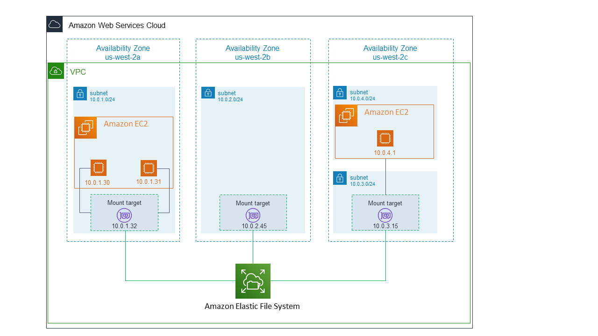

# Elastic File System (EFS)

* Stores files in an actual file system
* Uses standard file system features, such as locking files, updating files, and a hierarchy structure
* Unlike an EBS volume, EFS can be accessed by multiple EC2 instances at once
  * Useful for for parallel access of data
* Optimized for low-latency access
* Fully managed, highly available and durable
* Very scalable (can scale to petabytes)
* Allows users to browse cloud network resources
* Designed to maintain a high-level of throughput
* Follows standard file system semantics, such as strong consistency and file locking
* *Currently not supported on Windows*
* *Currently not supported in all regions*

## Connectivity

EC2 instances *do not* attach or connect directly to your EFS. Instead, the EC2 instances connect to your EFS via **mount targets**.

A **mount target** provides an IP address, which you can use to mount your EFS.
* Must be created in the same VPC as your EFS and EC2 instances
* If your EFS uses Standard storage classes, then there can be *at most 1* mount target per availability zone
* If your EFS uses One Zone storage classes, then you can only use 1 mount target **and** the mount target must be in the same availability zone as your EFS.

## Storage Classes

EFS offers 4 different storage classes
- Standard
- Standard Infrequent Access (IA)
- One Zone
- One Zone IA

|           |Standard|IA|
|-|-|-|
|Cost       |Standard cost|Reduced|
|Performance|Standard Latency|Higher Latency|

See the below diagrams comparing an EFS using Standard storage classes versus using One Zone storage classes:

* EFS with Standard storage class
  
* EFS with One Zone storage class
  

#### EFS Charges
- IA is cheaper than standard
- IA also charges for read/write (which is to incentevize you to make sure you use IA storage class less often)
- Standard charges only for the amount of storage space used

#### EFS Lifecycle Management
- Files are automatically moved between Standard and IA storage classes on a configurable period range (14/30/60/90 days)
- The only data that remain in standard instead of being rotated to IA are:
  - Files below 128KB in size
  - Any metadata in your files
- Suppose you set it to 30 days.
  - If a file is not accessed for 30 days, then it is moved from standard to IA
  - Then, if that same file is not accessed for another 30 days, the file is moved from IA to standard
- If your EFS file system was created after Feb 13 2019, then lifecycle management can be toggled on/off

## Performance Modes

||General Purpose|Max IO|
|-|-|-|
|Throughput|Standard|Unlimited|
|IOPS|`<=7k`|`>=7k`|
|Latency|Low|Higher|

When using General Purpose, CloudWatch provides the metric **percent IO limit**, which is your IOPS as a percentage of the `7k` limit
- Good so you can know whether or not you need to upgrade the performance mode

## Throughput Modes

EFS provides
1. Bursting throughput (default mode)
    - Throughput scales as your storage used grows
    - Capable of 100 mebibytes per second
      - With Standard storage class, can burst to 100 MiB/s PER TiB
      - So if you have 5 TiB of stored data, then you could have up to 500 MiB/s of thruput
    - Uses `BurstCreditBalance`, which accumulates during periods of low activity (<= 50 MiB/s per TiB)
      - Allows you to achieve throughput above your baseline limit. How long this bursted thruput lasts is based on your burst credit balance
2. Provisioned throughput
    - More expensive, but allows you to set a higher baseline throughput even if you are using less storage space
    - Also charged more for any bursting throughput that is above the default "Bursting Throughput" baseline
