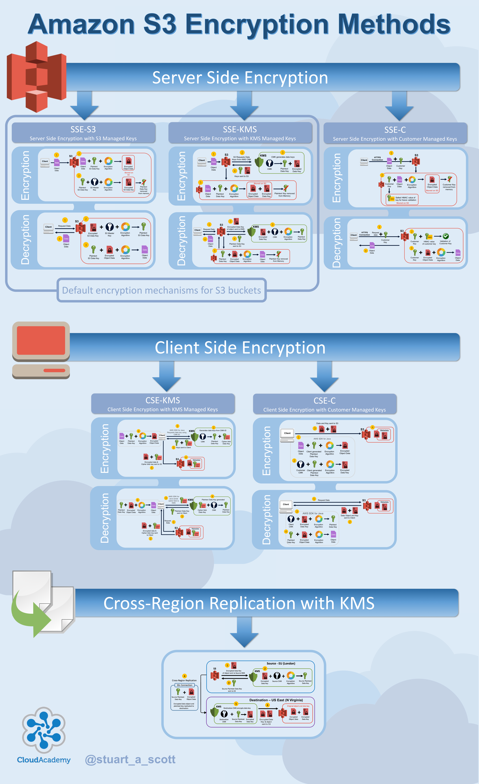

# Encryption Methods Overview

## Server-Side Encryption with S3 Managed Keys (SSE-S3)

Both encryption and decryption are done on the server using keys managed by the S3 bucket itself.

Minimal configuration

## Server-Side Encryption with KMS Managed Keys (SSE-KMS)

Both encryption and decryption are done on the server using keys provided by the Key Management Service (KMS).

S3 leverages KMS, so there's more key management (disabling, rotation, permissions)

## Server-Side Encryption with Customer Provided Keys (SSE-C)

Both encryption and decryption are done on the server, however the keys must be provided by the client when making a request to upload/download data.

S3 will only accept HTTPS connections (if it accepted HTTP, an easy MITM attack can occur, which renders the encryption useless)

## Client-Side Encryption with KMS Managed Keys (CSE-KMS)

Both encryption and decryption are done on the client, however the keys are provided by KMS.

## Client-Side Encryption with Customer Provided Keys (CSE-C)

Both encryption and decryption are done on the client using keys managed by the client themselves.
