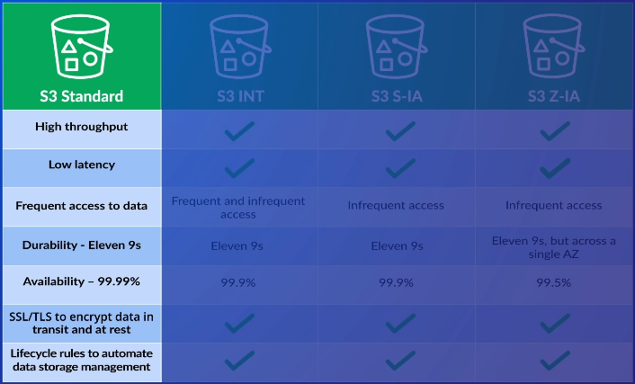
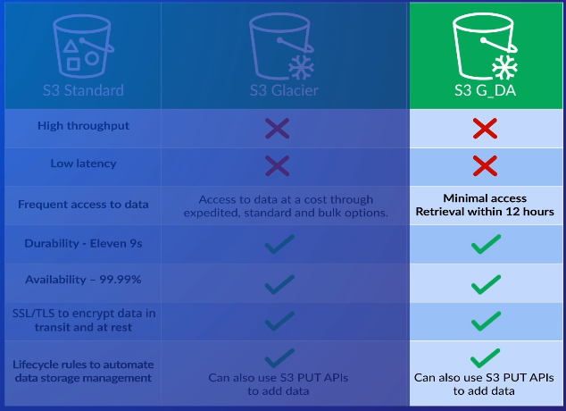
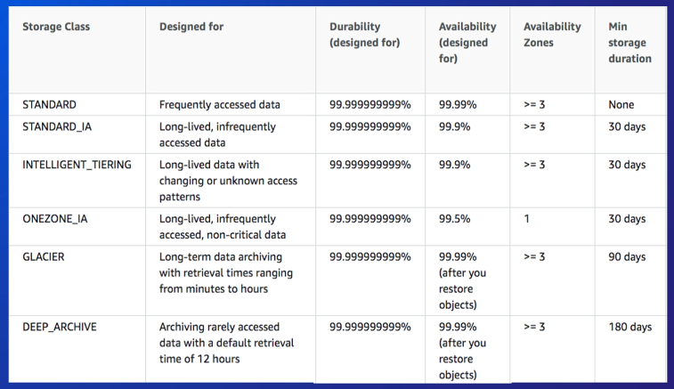

# Simple Storage Service (S3)

* Unlimited **object-based** file storage
* S3 is regional based
* Bucket name must be globally unique
* Supports SSL to encrypt data int transit
* Supports SSE and CSE (server-side and client-side encryption)
* Smallest file size is 0 bytes, largest file size is 5 TB
* Can have up to 100 buckets, but this is a soft limit and can be increased by asking AWS

### Availability vs Durability
* **Availability** refers to the up-time of your data
* **Durability** refers to probability of maintaining data without losing it (i.e. corrupted, data degradation)
  * S3 achieves high durability by replicating your data across multiple AZs (except in the case for "One Zone Infrequent Access" storage class)

## Storage Classes
* Standard
* Standard - Infrequent Access
* Intelligent Tiering
* One Zone - Infrequent Access
  * 20% storage cost reduction because data is not replicated to other AZs
* Glacier
* Glacier - Deep Archive
  - Cheapest option out of all other S3 classes
  - Only has 1 retrieval option, which is retrieving data within 12 hours or less
* Reduced Redundancy Storage (*not recommended*)

**Infrequent Access** classes cost more to retrieve data (hence the name)

**Intelligent Tiering** is used for unpredictable access patterns
* 2 tiers: frequently accessed and infrequently accessed
* Automatically moves data (that is being watched/monitored) into the appropriate tier (frequent vs infrequent tier) based on how often it is accessed
* Additional cost for each object monitored

## Security
- IAM policies
- Resource-based policies
  - Bucket Policies
* Access Control List (ACL)
* Data Encryption
- CORS

**Bucket policies** are resource-based policies that control access for a specific bucket
* Permissions can be very specific
* Applied at bucket level only
- Can grant cross-account access without creating and assuming roles from IAM

**ACLs** control access for users outside of your AWS account, such as public access
* Permissions are much broader compared to bucket policies
* Applied at bucket *and* object level
- Specifies **grantees**, which is an AWS account or an AWS group, that the ACL applies to
- Does not use same JSON format as IAM or resource-based policies
- Cannot be used to implicitly deny access
- Does not support conditional elements (like IAM policies do)
- Bucket ACLs
  - List objects
  - Write objects
    - `s3:DeleteObjectVersion` is restricted to bucket owner
  - Read the bucket's ACL
  - Update the bucket's ACL
- Object ACLs
  - NO write permission (unlike bucket ACL)
  - Read objects
  - Read object permissions
  - Write object permissions

For **data encryption**, S3 provides server-side encryption (SSE) and client-side encryption (CSE)
* Server-side encryption means the server will encrypt the data after it's uploaded
* Client-side encryption means the data is encrypted *prior* to uploading it to the server
* *Main difference:* where the data gets encrypted

**CORS** allows resources on a web page to be requested from a differnt domain other than its own
- The CORS policy contains rules
- Each rule has the following fields
  - `AllowedHeaders`
  - `AllowedMethods`
  - `AllowedOrigins` (i.e. `https://google.com`)
  - `ExposeHeaders` - defines a header in the response that is allowed to be made by customer apps
- A **preflight request** is made to S3 to see if the request is allowed based on the `Allowed*` fields above

## Data Management
* Versioning
* Lifecycle Rules

Can enable **versioning** in an S3 bucket (disabled by default)
* So multiple versions of an object are stored, and can retrieve any version at any time.
* Once enabled, you ***CANNOT*** disable it. Instead, you can only **suspend** versioning (either for the entire bucket or specific objects)
* Additional cost for versioning objects
- If you enable versioning, any objects that existed before enabling the feature will have a "NULL" version
- Deleting a versioned object
  - The _current_ version is _marked for deletion_. This means any GET rqeuest to the object returns a 404
  - _All previous_ versions can still be fetched via API by specifying the version ID
  - To permanently delete a versioned object, delete the object and specify the version id
  - If you permanently delete the version with the delete marker, then the object re-appears in your bucket using the latest version that _is not marked for deletion_

**Lifecycle rules** automatically manages your data based on a time period
* Time period is configurable (i.e. 30 days, 90 days, etc)
* Once time period passes, then AWS can do the following (but not limited to):
  * Move the data to another storage class
  * Move data to Amazon Glacier
  * Delete the data

## Logging

### Server-Access Logging

Captures details of requests to your bucket and objects
- **Does not guarantee** that (a) every request is captured or even (b) a log is generated for a request within a time frame

Logs are stored in a **target bucket**. S3 needs permissions to write access logs to the **target bucket**
  - Need write access for a group known as **Log Delivery Group**, a pre-defined S3 group that delivers log files to your target buckets
  - When access logging is enabled via console, this is done automatically. The Log Delivery Group is added to your **target bucket's ACL** (access control list)
  - When access logging is enabled via API, then you need to manually configure these permissions

Source and target buckets **must be in same region**
- Use different target buckets for each source

Permissions of the Log Group can only be assigned via ACLs, not through bucket policies

If encryption is enabled on target bucket, then the encryption must be set to SSE-S3 (SSE managed by S3). Otherwise access logs will not be delivered.
- **Encryption with KMS is not supported for the target buckets**

### Object-Level Logging

More related to **CloudTrail** since this tracks S3 data events, like `GetObject` or `DeleteObject`

Setup in 2 ways
1. Configure an existing trial in CloudTrail (or make a new one) to capture data events (read or write) from a bucket
2. Configure the S3 bucket and enable "Object Level Logging", specify which events to capture, and which trail to use
- **Note: trail and bucket must be in same region**

## Transfer Acceleration

Speed up S3 data transfers by utilizing CloudFront CDNs.

Ingress traffic incurs additional charges (when not using Transfer Acceleration, ingress traffic is free)

Egress traffic incurs even more additional charges

Bucket name must be DNS compliant, cannot have any periods/dots

Given a new endpoint once enabled, and this endpoint should be used for all requests (getting, deleting, updating). This endpoint is specifically for utilizing Transfer Acceleration

Does not support following S3 operations
- `GET Service` (listing buckets)
- `PUT Bucket` (create bucket)
- `DELETE Bucket`
- Cross region copies using `PUT Object -Copy`

## Use Cases
* Backing up data
* Static content/static websites
* Large datasets
* Integration with other AWS services
  * ex) An EBS instance can create a snapshot of itself and saves it in a (hidden) S3 bucket

## Bad Use Cases
* Archiving data
* Data is very dynamic and changes frequently
* Data being stored requires an actual file system (recall that S3 is *object-based* file storage)
* Structured data that needs to be queried
